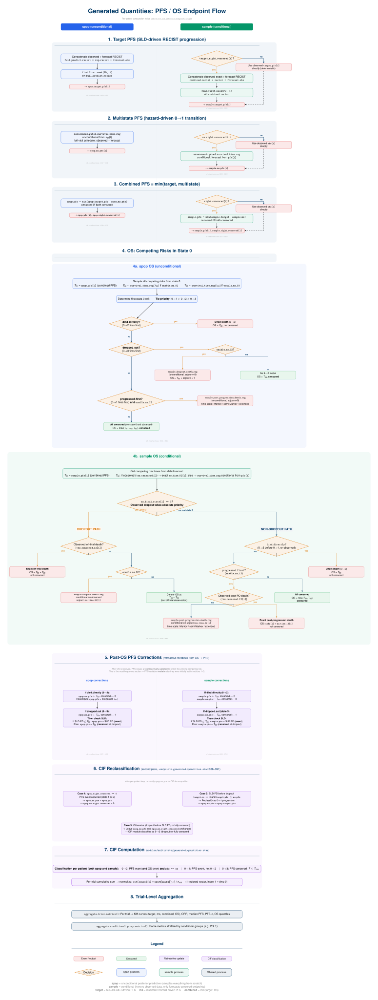

# Generated Quantities: PFS / OS Endpoint Flow

> **Diagram**: [`quarto/website/images/gq-pfs-flow.svg`](../quarto/website/images/gq-pfs-flow.svg)
> (Open the SVG directly in a browser for full-resolution pan/zoom navigation.)



## How to Read This Diagram

The diagram documents the complete flow of PFS and OS endpoint calculation inside the Stan generated quantities block. It is organized as **two parallel swim lanes**:

| Lane | Prefix | Meaning |
|------|--------|---------|
| **Left (blue)** | `spop_*` | Unconditional posterior predictive — samples everything from scratch using the fitted model, ignoring observed endpoints |
| **Right (teal)** | `sample_*` | Conditional — honors observed data for patients with events, only forecasts what is right-censored |

## Sections

### 1. Target PFS (SLD-driven RECIST progression)
- **Source**: `sf.stanfunctions:1443-1495`
- Uses `find_first_week(PD)` on RECIST sequences
- spop always uses full predicted RECIST (observed replicated + forecast)
- sample uses observed exact RECIST for non-censored patients

### 2. Multistate PFS (hazard-driven 0->1 transition)
- **Source**: `sf.stanfunctions:1497-1515`
- Uses `assessment_gated_survival_time_rng()` — accumulates hazard between assessment visits
- spop is always unconditional; sample conditions on `pfs[i]` for censored patients

### 3. Combined PFS
- **Source**: `sf.stanfunctions:1517-1530`
- `combined_pfs = min(target_pfs, ms_pfs)` — first of SLD progression or multistate event
- Censored only if *both* target and multistate are censored

### 4. OS: Competing Risks in State 0
- **Source**: `sf.stanfunctions:1536-1720`
- Three competing exits from state 0: progression (0->1), direct death (0->2), dropout (0->3)
- **Tie priority**: 0->1 > 0->2 > 0->3
- Post-event death routing depends on `enable_ms_12`, `enable_ms_32`, `ms_time_scale_12`
- Sample pathway uses observed data when available (exact death/sojourn times)

### 5. Post-OS PFS Corrections (retroactive feedback)
- **Source**: `sf.stanfunctions:1597-1620` (spop), `1696-1719` (sample)
- **Key bug-prone area**: After OS is resolved, PFS is retroactively updated:
  - If direct death (0->2) won: `ms_pfs` is set to death time, combined PFS recomputed
  - If dropout (0->3) won: `ms_pfs` censored at dropout; SLD PD only counts if it occurred *before* dropout

### 6. CIF Reclassification (second pass over patients)
- **Source**: `_endpoints_generated_quantities.stan:366-391`
- Reclassifies `spop_ms_pfs` for CIF decomposition after the per-patient loop
- Handles edge case where SLD-predicted PD precedes dropout in state-3 patients

### 7. CIF Computation
- **Source**: `modules/multistate/generated_quantities.stan:1-87`
- Classifies each patient into cause: 0->1 (progression), 0->2 (direct death), 0->3 (dropout)
- Cumulative sum normalized by trial size

### 8. Trial-Level Aggregation
- **Source**: `sf.stanfunctions:1817-2046`
- KM curves per PFS variant (target, ms, combined) and OS
- ORR, median PFS, PFS-n, OS quantiles
- Same metrics stratified by conditional groups (e.g. PDL1)

## Key Variable Names

| Variable | Meaning |
|----------|---------|
| `*_target_pfs` | PFS from SLD/RECIST only (target lesion PD) |
| `*_ms_pfs` | PFS from multistate hazard (0->1 transition) |
| `*_pfs` | Combined PFS = min(target, ms) |
| `*_os` | Overall survival (after competing risks routing) |
| `*_right_censored` | 1 = censored, 0 = event observed |
| `*_km_est` | Kaplan-Meier survival curve vector |
| `*_cif_01/02/03` | Cumulative incidence function by cause |

## Recompiling the Diagram

From the project root:

```bash
PDFLATEX="$HOME/.TinyTeX/bin/x86_64-linux/pdflatex"
$PDFLATEX -output-directory=quarto/website/images quarto/website/images/gq-pfs-flow.tex
pdf2svg quarto/website/images/gq-pfs-flow.pdf quarto/website/images/gq-pfs-flow.svg
rm -f quarto/website/images/gq-pfs-flow.{aux,log,pdf}
```
