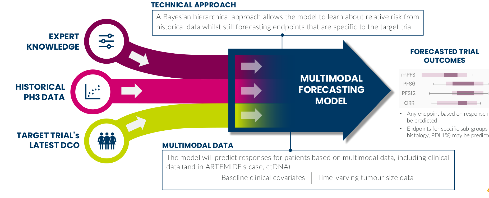
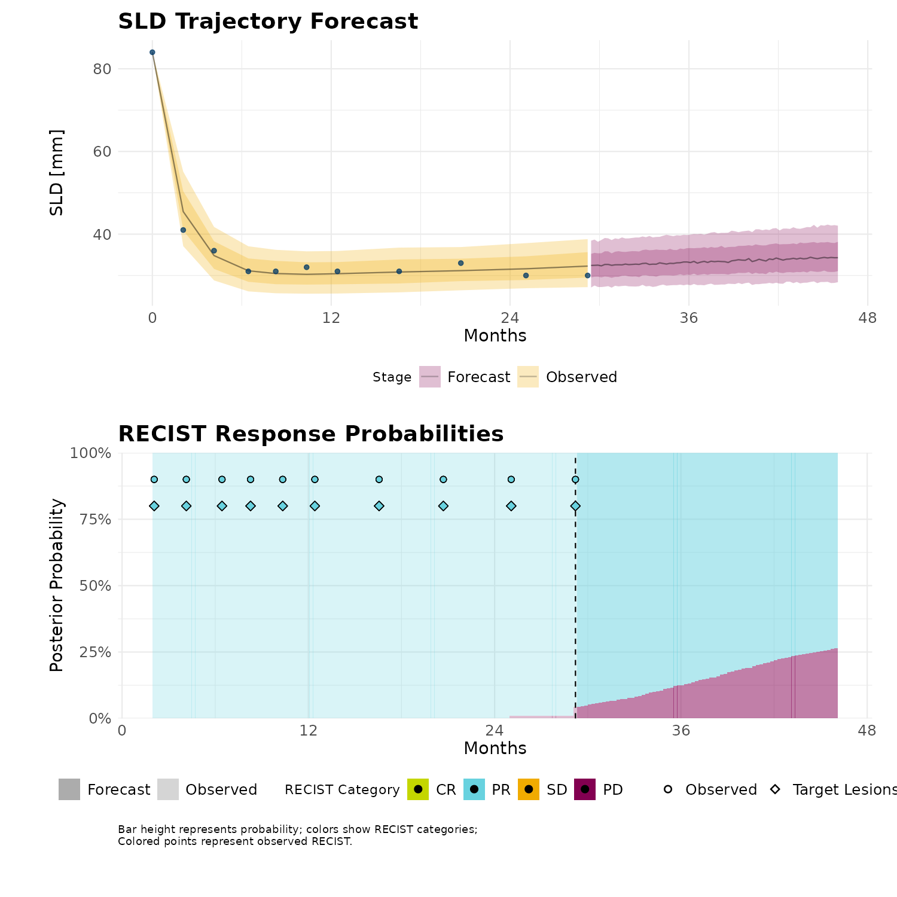
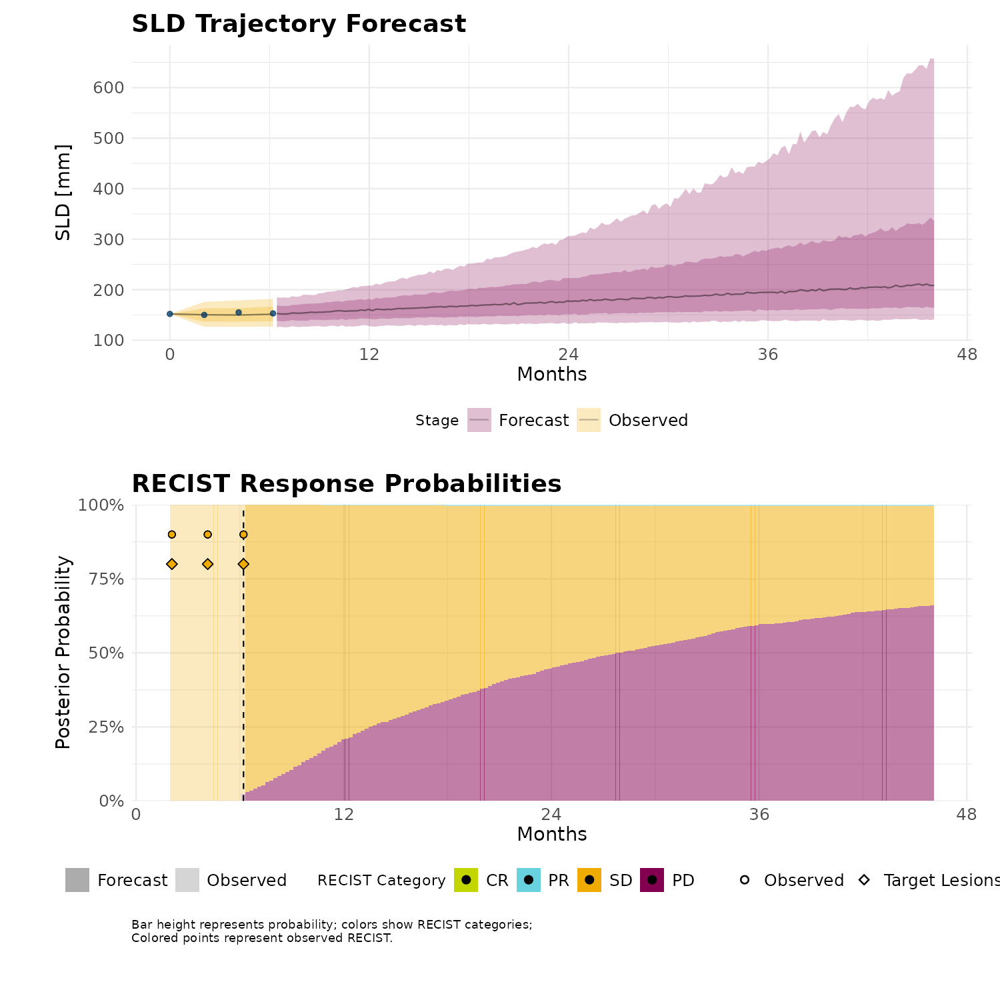
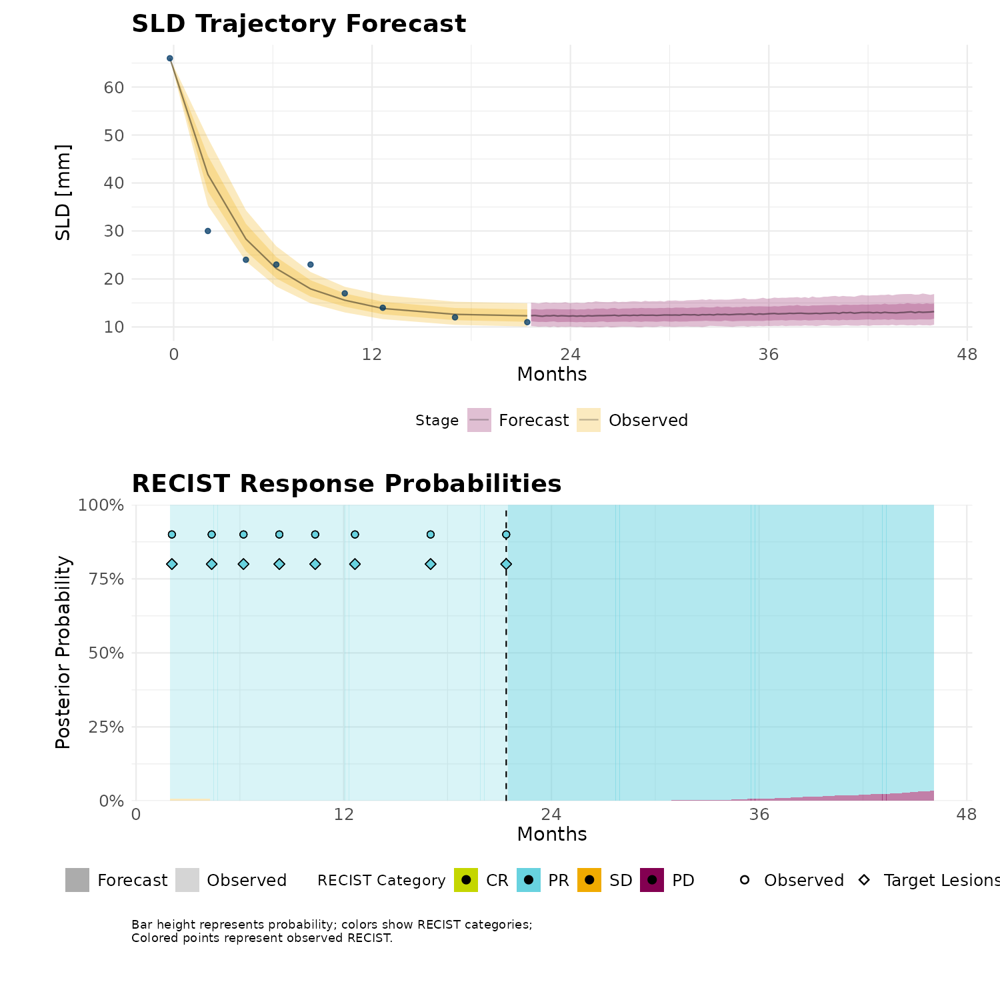
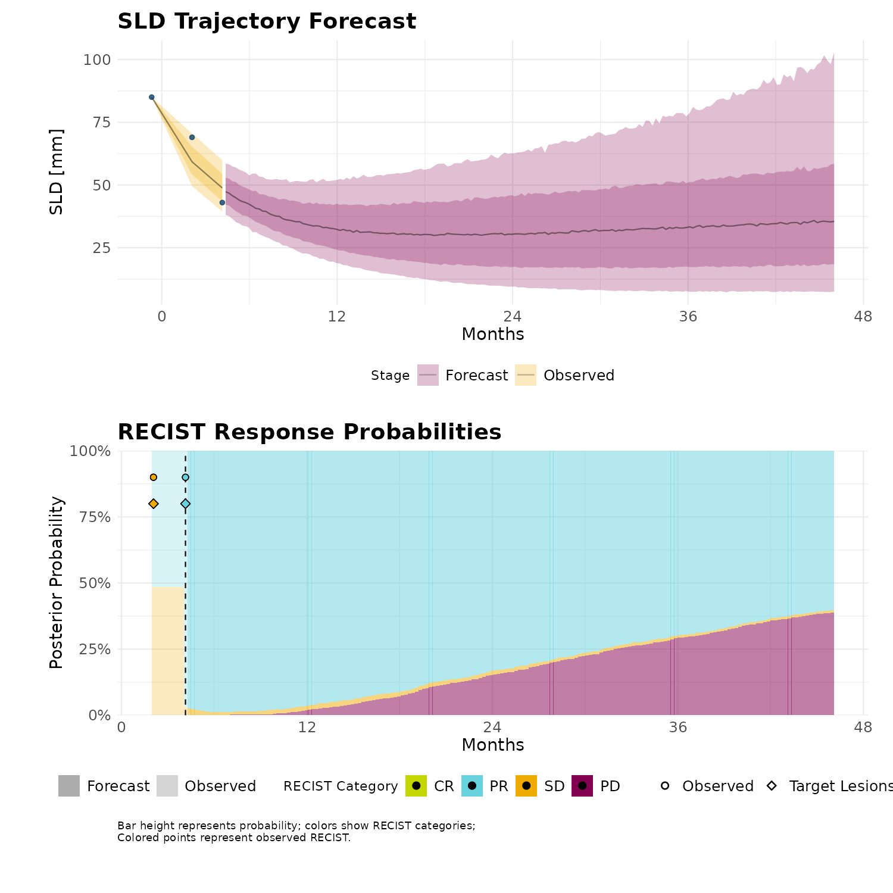
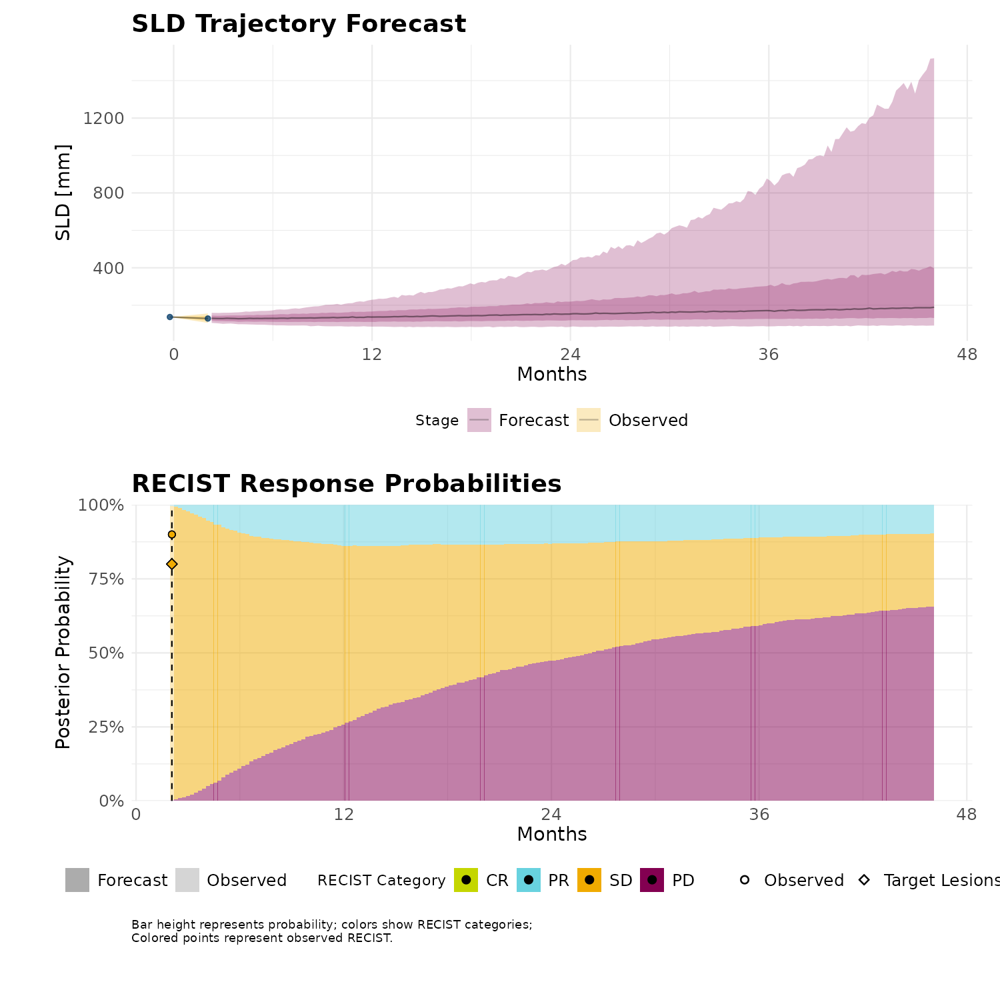
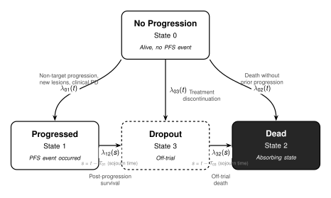
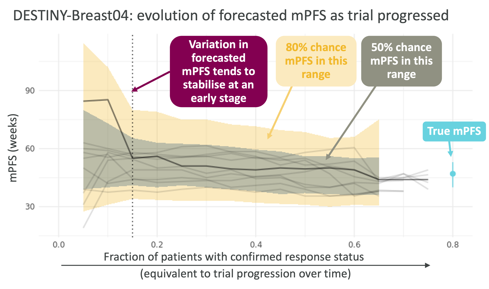

```{r setup}
#| include: false
#| cache: false

# Source shared setup from project root
source(here::here("quarto", "_shared", "_setup.R"))
```

# Introduction {visibility="hidden"}

## Executive Summary {.smaller}

:::: {.columns}

::: {.column width="35%"}

- **Reliable early forecasts**:
    * PIONEER delivers **reliable predictions 3-6 months earlier** than the latest DCO observational-only analyses
    * While uncertainty diminished with more data, our model is able to provide survival information beyond the censoring horizon.

- **High accuracy**: Out-of-sample RECIST prediction sensitivity ranging from **70-80%** across response categories

- **Validated approach**: _Leave-future-out cross-validation_ confirms predictive performance

```{r exec-summary-timeline}
#| fig-width: 6
#| fig-height: 2.8
#| out-width: 100%
#| fig-align: center
#| cache: false

dco_dates <- tibble(
  dco  = c("DCO1", "DCO2", "DCO3"),
  date = as.Date(c("2025-04-30", "2025-08-30", "2026-01-22"))
)

part_e_data <- all_analysis_data |>
  filter(fct_match(trial, "sclc"), fct_match(arm, "E01"))

x_limits <- c(min(part_e_data$trtsdt), max(dco_dates$date))

p_enrollment <- part_e_data |>
  select(usubjid, trtsdt, visit_data) |>
  unnest(visit_data) |>
  mutate(visit_date = trtsdt + ady) |>
  group_by(usubjid) |>
  summarise(first_visit = min(visit_date), .groups = "drop") |>
  ggplot(aes(x = first_visit)) +
  geom_vline(aes(xintercept = date), color = AZ_pink, linewidth = 0.8, data = dco_dates) +
  geom_histogram(binwidth = 30, fill = AZ_navy, alpha = 0.75, color = "white") +
  geom_label(aes(x = date, label = dco), y = Inf, vjust = 1.3,
             data = dco_dates, size = 2.5, color = "white", fill = AZ_pink,
             fontface = "bold", label.padding = unit(0.2, "lines"),
             label.r = unit(0.3, "lines")) +
  scale_x_date("", limits = x_limits) +
  scale_y_continuous("Patients") +
  theme_minimal(base_size = 9) +
  theme(panel.grid.minor = element_blank())

p_visits <- part_e_data |>
  select(usubjid, trtsdt, visit_data) |>
  unnest(visit_data) |>
  mutate(visit_date = trtsdt + ady) |>
  ggplot(aes(x = visit_date)) +
  geom_vline(aes(xintercept = date), color = AZ_pink, linewidth = 0.8, data = dco_dates) +
  geom_histogram(binwidth = 30, fill = AZ_turquoise, alpha = 0.75, color = "white") +
  scale_x_date("Date", limits = x_limits) +
  scale_y_continuous("Assessments") +
  theme_minimal(base_size = 9) +
  theme(panel.grid.minor = element_blank())

p_enrollment / p_visits
```

:::

::: {.column width="65%"}

```{r part-e-summary-plots}
#| fig-width: 10
#| fig-height: 7.5
#| out-width: 100%
#| cache: false

# Helper to filter cond KM target to Part E posterior
filter_part_e <- function(df, km_col, dco_label) {
  df |>
    filter(
      fct_match(variable, "parts"),
      fct_match(cond_group_name, "part_e"),
      fct_match(fit_type, "posterior")
    ) |>
    mutate(
      km_est = {{ km_col }},
      dco = dco_label,
      trial = "sclc"
    )
}

# PFS conditional KM across DCOs
cond_km_pfs <- bind_rows(
  filter_part_e(tar_read(all_tumor_ssls_cond_km_rvar_ctdna_apr25),  cond_sample_km_est, "Apr25"),
  filter_part_e(tar_read(all_tumor_ssls_cond_km_rvar_ctdna_aug25),  cond_sample_km_est, "Aug25"),
  filter_part_e(tar_read(all_tumor_ssls_cond_km_rvar_ctdna_jan26),  cond_sample_km_est, "Jan26")
) |> mutate(dco = factor(dco, levels = c("Apr25", "Aug25", "Jan26")))

# OS conditional KM across DCOs
cond_km_os <- bind_rows(
  filter_part_e(tar_read(all_tumor_ssls_cond_km_os_rvar_ctdna_apr25), cond_sample_os_km_est, "Apr25"),
  filter_part_e(tar_read(all_tumor_ssls_cond_km_os_rvar_ctdna_aug25), cond_sample_os_km_est, "Aug25"),
  filter_part_e(tar_read(all_tumor_ssls_cond_km_os_rvar_ctdna_jan26), cond_sample_os_km_est, "Jan26")
) |> mutate(dco = factor(dco, levels = c("Apr25", "Aug25", "Jan26")))

# Observed PFS KM for Part E
obs_km_pfs <- bind_rows(
  apr25 = tar_read(km_trial_pfs_part_e_ctdna_apr25),
  aug25 = tar_read(km_trial_pfs_part_e_ctdna_aug25),
  jan26 = tar_read(km_trial_pfs_part_e_ctdna_jan26),
  .id = "dco"
) |>
  filter(fct_match(btype, "ub")) |>
  select(!quantiles) |>
  unnest(km_data) |>
  mutate(dco = fct_recode(factor(dco), "Apr25" = "apr25", "Aug25" = "aug25", "Jan26" = "jan26"))

# Observed OS KM for Part E (unstratified)
obs_km_os <- bind_rows(
  apr25 = tar_read(km_trial_os_part_e_ctdna_apr25),
  aug25 = tar_read(km_trial_os_part_e_ctdna_aug25),
  jan26 = tar_read(km_trial_os_part_e_ctdna_jan26),
  .id = "dco"
) |>
  filter(fct_match(btype, "ub")) |>
  select(!quantiles) |>
  unnest(km_data) |>
  mutate(dco = fct_recode(factor(dco), "Apr25" = "apr25", "Aug25" = "aug25", "Jan26" = "jan26"))

km_theme <- theme(
  plot.title      = element_text(size = 13, face = "bold"),
  strip.text      = element_text(size = 11, face = "bold"),
  legend.position = "bottom",
  plot.caption    = element_text(size = 7, hjust = 0)
)

p_pfs <- cond_km_pfs |>
  base_plot_km(obs_km_data = NULL, km_est = km_est, group = fit_type,
               linewidth = 0.5, alpha = 0.25) +
  geom_step(aes(x = t, y = s, linetype = "Observed KM"),
            linewidth = 1.2, alpha = 0.5, color = AZ_plum, data = obs_km_pfs) +
  scale_linetype_manual("", values = c("Observed KM" = "solid")) +
  scale_x_continuous("Months", breaks = months_to_weeks(seq(0, 60, 12)),
                     label = label_weeks_to_months) +
  scale_y_continuous("PFS", labels = scales::percent) +
  scale_fill_manual(values = AZ_platinum) +
  guides(color = "none", fill = "none", alpha = "none") +
  facet_wrap(~dco, ncol = 3) +
  labs(title = "Part E PFS Forecast by DCO") +
  km_theme

p_os <- cond_km_os |>
  base_plot_km(obs_km_data = NULL, km_est = km_est, group = fit_type,
               linewidth = 0.5, alpha = 0.25) +
  geom_step(aes(x = t, y = s, linetype = "Observed KM"),
            linewidth = 1.2, alpha = 0.5, color = AZ_plum, data = obs_km_os) +
  scale_linetype_manual("", values = c("Observed KM" = "solid")) +
  scale_x_continuous("Months", breaks = months_to_weeks(seq(0, 60, 12)),
                     label = label_weeks_to_months) +
  scale_y_continuous("OS", labels = scales::percent) +
  scale_fill_manual(values = AZ_platinum) +
  guides(color = "none", fill = "none", alpha = "none") +
  facet_wrap(~dco, ncol = 3) +
  labs(title = "Part E OS Forecast by DCO") +
  km_theme

# Stack PFS over OS; save for reuse at end-summary slide
p_exec_summary <- p_pfs / p_os
p_exec_summary
```

:::

::::

::: {.notes}

* **What is the model**: 
  - A Bayesian multimodal, dynamic model for forecasting trial outcomes (e.g., PFS, ORR)
  - It is a **digital twin** model that uses a mechanistic model to forecast **patient-level** outcomes.
* From **three different projects/experiments**: we can say that this approach could give us a 3-6 month lead time in go/no-go decisions.
* In this plot: 
  - We focus on the Part E patients as those give us a good sense of how the model with little data is able to forecast survival.
  - We see how as more data is available while the observed KM is truncated, the predictive model is able forecast out with relative stability.
  - **Ground Truth**: Qualitatively here we see how the the observed data over the DCOs sharpens but does not alter the pattern of the forecast KM. 

:::


# {.section-intro}

:::: {.columns style="align-items: center;"}

::: {.column width="35%"}
Model Structure
:::

::: {.column width="65%"}

- Multimodal integration of expert knowledge, historical trials, and SCLC-01 data
- Patient-level digital twin approach based on a tumor growth inhibition (TGI) model
- From tumor size trajectories to RECIST responses and survival endpoints

:::

::::

## Model Architecture Diagram {.center}

<br>

{fig-align="center" width="90%"}

::: {.notes}

The model is multimodal over heterogenous sources of information: 

1. Expert/domain knowledge: 
  * prior elicitation (Shefield Elicitation Framework, SHELF) 
  * Two populations mechanistic model (pharmokinetic literature)
2. Historical patient level data
3. Available data from the target trial at the point of analysis

From the data, we use both baseline features (clinical covariates and ctdna if available) and longitudinal measures (the most important of which is patient-level tumor size trajectories).

Using this info, we model (probabilistically) the data generating process for tumor sizes and responses. 

From these we generate what the future outcomes (beyond censoring) would look like.  

:::


## Digital Twin: From Tumor Size to RECIST Response {.center}

:::: {.columns}

::: {.column width="38%"}

<br>

- From observed **tumor size (SLD)** we train the semi-mechanistic model

- Patient-level **tumor sizes** are **forecasted beyond the point of censoring**

- From this distribution of possible trajectories, **we can calculate the patient-level probability** of each **RECIST response** at **any point in time**

:::

::: {.column width="62%"}

```{r digital-twin-frames}
#| include: false

# Check if all frames exist
frames_exist <- all(file.exists(
  here::here("quarto/presentations/pioneer-gng/images", sprintf("digital-twin-frame-%d.png", 1:5))
))

if (!frames_exist) {
  message("Generating digital twin frames...")

  # Generate 5 patient frames
  library(targets)
  library(patchwork)
  library(dplyr)

  sld_data <- tar_read(tumor_ssls_staged_sld_rvar_right_censored_posterior_ctdna_jan26) |>
    dplyr::filter(fct_match(trial, "sclc"))

  recist_data <- tar_read(tumor_ssls_staged_recist_rvar_right_censored_posterior_ctdna_jan26) |>
    dplyr::filter(fct_match(trial, "sclc"))

  # Pick 5 patients
  example_patients <- sld_data |>
    dplyr::group_by(usubjid) |>
    dplyr::filter(dplyr::n() >= 4) |>
    dplyr::ungroup() |>
    dplyr::distinct(usubjid) |>
    dplyr::slice_head(n = 5) |>
    dplyr::pull(usubjid)

  # Print selected patients for debugging
  message("Selected patients: ", paste(example_patients, collapse = ", "))

  # Generate frames
  for (i in seq_along(example_patients)) {
    patient_id <- example_patients[i]

    sld_single <- sld_data |> dplyr::filter(usubjid == patient_id)
    recist_single <- recist_data |> dplyr::filter(usubjid == patient_id)

    p1 <- plot_sld_forecast_censored(sld_single) +
      labs(title = sprintf("SLD Trajectory Forecast - Patient %d", i)) +
      theme(
        plot.title = element_text(size = 18, face = "bold"),
        axis.title = element_text(size = 14),
        axis.text = element_text(size = 12),
        legend.text = element_text(size = 12)
      )

    p2 <- plot_recist_censored(recist_single) +
      labs(title = sprintf("RECIST Response Probabilities - Patient %d", i)) +
      theme(
        plot.title = element_text(size = 18, face = "bold"),
        axis.title = element_text(size = 14),
        axis.text = element_text(size = 12),
        legend.text = element_text(size = 12),
        strip.text = element_blank()
      )

    p <- p1 / p2

    output_path <- here::here("quarto/presentations/pioneer-gng/images", sprintf("digital-twin-frame-%d.png", i))
    ggsave(output_path, p, width = 10, height = 10, dpi = 150, bg = "white")
  }

  message("Digital twin frames generated successfully")
} else {
  message("Digital twin frames already exist, skipping generation")
}
```

<div id="digital-twin-slideshow" style="width: 85%; position: relative; margin: 0 auto;">
  
  <!-- Hidden preloaded images for embedding -->
  
  
  
  
  
</div>

<script>
(function() {
  // Reference the pre-embedded images by ID
  const imageIds = [
    'digital-twin-frame-1',
    'digital-twin-frame-2',
    'digital-twin-frame-3',
    'digital-twin-frame-4',
    'digital-twin-frame-5'
  ];

  let currentIndex = 0;
  const imgElement = document.getElementById('digital-twin-img');

  // Smooth fade transition
  imgElement.style.transition = 'opacity 0.5s ease-in-out';

  function nextImage() {
    // Fade out
    imgElement.style.opacity = '0';

    // Wait for fade out, then change image and fade in
    setTimeout(() => {
      currentIndex = (currentIndex + 1) % imageIds.length;
      const sourceImg = document.getElementById(imageIds[currentIndex]);
      imgElement.src = sourceImg.src;
      console.log('Switching to frame:', currentIndex + 1);

      // Fade in
      setTimeout(() => {
        imgElement.style.opacity = '1';
      }, 50);
    }, 500);
  }

  // Auto-advance every 10 seconds
  setInterval(nextImage, 10000);
})();
</script>

:::

::::

::: {.notes}

**Here we see**, how we forecast outcomes: 

* We demonstrate this using few patients. 
* For all patients, there would be similar personalized trajectory.
* We learn tumour dynamics from the historical trials and then use that knowledge to extrapolate forward

On the top: 

* How our model fits the observed data (dots). We see this is the yellow probabilistic ribbon.
* The purple ribbon represents the forecast tumor sizes beyond censoring

On the bottom:

* These tumor sizes then determine what the response (its probability) would be at every point in time.
* (The shapes near the top represent the overall and target response from the data).
* From that, we get endpoints such as PFS and ORR.


:::


## Model Data Flow {.center}

::: {.column-page}

{fig-align="center" width="95%"}

:::

::: {.notes}

* In the previous two slides we talked about the mechanistic submodel.
* That submodel does not actually handle non-target lesion events and death.
* For that we jointly use a survival model that captures those "residual" events.

:::


## Illness-Death Multistate Model {.center}

::: {.column-page}

{fig-align="center" width="80%"}

:::

::: {.notes}

* Progression and death are modeled as distinct transitions — not competing risks.
* Five transitions: progression ($\lambda_{01}$), death without progression ($\lambda_{02}$), post-progression death ($\lambda_{12}$), dropout ($\lambda_{03}$), and off-trial death ($\lambda_{32}$).
* The illness-death structure allows the model to capture post-progression survival and differentiate between patients who die on vs off trial.

:::


## Model Mathematical Specification {.smaller}

:::: {.columns}

::: {.column width="50%"}

**Tumor Growth Inhibition (TGI) State-Space Model**

Latent tumor state decomposes into two components:

$$
\log(\text{SLD}_i(t)) = \log\left(e^{x_{i,\text{dec}}(t)} + e^{x_{i,\text{gro}}(t)}\right)
$$

**State evolution** between visits:

$$
\begin{bmatrix} x_{i,\text{dec}}(t+1) \\ x_{i,\text{gro}}(t+1) \end{bmatrix} = \begin{bmatrix} x_{i,\text{dec}}(t) \\ x_{i,\text{gro}}(t) \end{bmatrix} + \Delta t \begin{bmatrix} -d_i \\ g_i \end{bmatrix}
$$

**Rate parameters** with hierarchical structure:

$$
\log(r_i) = \mu_{r,\text{pop}} + \eta_{r,s(i)}^{\text{trial}} + \eta_{r,i}^{\text{patient}} + \mathbf{X}_i^T \boldsymbol{\beta}_r
$$

where $d_i = r_i \cdot \phi_i$ and $g_i = r_i \cdot (1 - \phi_i)$

:::

::: {.column width="50%"}

**Independent Competing Risks**

PFS combines target progression and other events:

$$
T_i^{\text{PFS}} = \min(T_i^{\text{target}}, T_i^{\text{other}})
$$

- $T_i^{\text{target}}$: first time RECIST = PD (from tumor model)
- $T_i^{\text{other}}$: non-target progression, death

**Other events hazard** (proportional hazards):

$$
\lambda_i(t) = \lambda_{0,s}(t) \cdot \exp\left(\mathbf{Z}_i^T \boldsymbol{\theta} + \mathbf{W}_i(t)^T \boldsymbol{\kappa}\right)
$$

where $\mathbf{W}_i(t)$ includes tumor-derived time-varying covariates (predicted SLD, growth rate, velocity).

:::

::::

::: {.notes}

**Tumor dynamics (left)**:
- Two-component TGI state-space model in log-space (extends the classic Stein-Fojo biexponential)
- Decreasing component captures treatment-sensitive cells
- Growing component captures resistant/proliferating cells
- All rate parameters follow 3-level hierarchy (population → trial → patient)
- Total rate $r_i$ and fraction $\phi_i$ determine speed and balance of dynamics

**Other events (right)**:
- Independent survival model for non-target progression and death
- Time-varying covariates from tumor model link the two submodels
- Gaussian process baseline hazard allows flexible shape
- Combined via competing risks: first event determines PFS

:::


# {.section-intro}

:::: {.columns style="align-items: center;"}

::: {.column width="35%"}
DCO Endpoint Evolution
:::

::: {.column width="65%"}

- Tracking endpoint predictions across three data cutoffs (Apr 25, Aug 25, Jan 26)
  - Overall Response Rate (ORR)
  - Median PFS
  - PFS at fixed timepoints
  - Median Overall Survival (OS)
- Results shown for **all** patients, **first line** patients, and **Part E** patients
- Both sample-based and superpopulation estimates are presented

:::

::::

## ORR by Data Cutoff {.smaller}

```{r dco-data-setup}
#| include: false

# Load multi-DCO data for endpoint comparisons
orr_list <- list(
  apr25 = tar_read(all_tumor_ssls_orr_rvar_ctdna_apr25),
  aug25 = tar_read(all_tumor_ssls_orr_rvar_ctdna_aug25),
  jan26 = jan26_orr_data
)
cond_orr_list <- list(
  apr25 = tar_read(all_tumor_ssls_cond_orr_rvar_ctdna_apr25),
  aug25 = tar_read(all_tumor_ssls_cond_orr_rvar_ctdna_aug25),
  jan26 = jan26_cond_orr_data
)

quant_pfs_list <- list(
  apr25 = tar_read(all_tumor_ssls_trial_quant_pfs_ctdna_apr25),
  aug25 = tar_read(all_tumor_ssls_trial_quant_pfs_ctdna_aug25),
  jan26 = jan26_quant_pfs_data
)
cond_quant_pfs_list <- list(
  apr25 = tar_read(all_tumor_ssls_cond_quant_pfs_ctdna_apr25),
  aug25 = tar_read(all_tumor_ssls_cond_quant_pfs_ctdna_aug25),
  jan26 = jan26_cond_quant_pfs_data
)

obs_km_list <- list(
  apr25 = list(
    all = tar_read(km_trial_pfs_ctdna_apr25),
    pdl1_naive = tar_read(km_trial_pfs_pdl1_naive_ctdna_apr25),
    pdl1 = tar_read(km_trial_pfs_pdl1_ctdna_apr25),
    naive = tar_read(km_trial_pfs_naive_ctdna_apr25)
  ),
  aug25 = list(
    all = tar_read(km_trial_pfs_ctdna_aug25),
    pdl1_naive = tar_read(km_trial_pfs_pdl1_naive_ctdna_aug25),
    pdl1 = tar_read(km_trial_pfs_pdl1_ctdna_aug25),
    naive = tar_read(km_trial_pfs_naive_ctdna_aug25)
  ),
  jan26 = list(
    all = jan26_obs_km_all,
    pdl1_naive = jan26_obs_km_pdl1_naive,
    pdl1 = jan26_obs_km_pdl1,
    naive = jan26_obs_km_first_line
  )
)

quant_os_list <- list(
  apr25 = tar_read(all_tumor_ssls_trial_quant_os_ctdna_apr25),
  aug25 = tar_read(all_tumor_ssls_trial_quant_os_ctdna_aug25),
  jan26 = tar_read(all_tumor_ssls_trial_quant_os_ctdna_jan26)
)
cond_quant_os_list <- list(
  apr25 = tar_read(all_tumor_ssls_cond_quant_os_ctdna_apr25),
  aug25 = tar_read(all_tumor_ssls_cond_quant_os_ctdna_aug25),
  jan26 = tar_read(all_tumor_ssls_cond_quant_os_ctdna_jan26)
)

obs_km_os_list <- list(
  apr25 = list(
    all        = tar_read(km_trial_os_ctdna_apr25),
    pdl1_naive = tar_read(km_trial_os_pdl1_naive_ctdna_apr25),
    pdl1       = tar_read(km_trial_os_pdl1_ctdna_apr25),
    naive      = tar_read(km_trial_os_naive_ctdna_apr25)
  ),
  aug25 = list(
    all        = tar_read(km_trial_os_ctdna_aug25),
    pdl1_naive = tar_read(km_trial_os_pdl1_naive_ctdna_aug25),
    pdl1       = tar_read(km_trial_os_pdl1_ctdna_aug25),
    naive      = tar_read(km_trial_os_naive_ctdna_aug25)
  ),
  jan26 = list(
    all        = tar_read(km_trial_os_ctdna_jan26),
    pdl1_naive = tar_read(km_trial_os_pdl1_naive_ctdna_jan26),
    pdl1       = tar_read(km_trial_os_pdl1_ctdna_jan26),
    naive      = tar_read(km_trial_os_naive_ctdna_jan26)
  )
)

pfs_n_list <- list(
  apr25 = tar_read(all_tumor_ssls_forecast_target_pfs_n_rvar_ctdna_apr25),
  aug25 = tar_read(all_tumor_ssls_forecast_target_pfs_n_rvar_ctdna_aug25),
  jan26 = jan26_pfs_n_data
)
cond_pfs_n_list <- list(
  apr25 = tar_read(all_tumor_ssls_cond_forecast_target_pfs_n_rvar_ctdna_apr25),
  aug25 = tar_read(all_tumor_ssls_cond_forecast_target_pfs_n_rvar_ctdna_aug25),
  jan26 = jan26_cond_pfs_n_data
)
```

:::: {.columns}

::: {.column width="33%"}

**Overall Response Rate Evolution**

- For **all** patients estimates, ORR is is precisely estimated and stable across DCOs
- For **first line** patients, especially the PDL1 Low patients, the outcomes are less stable with more data
- For **Part E** patients, there is good stability and overlap over time but with greater uncertainty

:::

::: {.column width="67%"}

::: {.panel-tabset}

### Sample-Based

```{r orr-dco-sample}
#| fig-width: 12
#| fig-height: 8

plot_orr_by_dco("sample", orr_list, cond_orr_list, show_priors = FALSE) +
  labs(title = "Overall Response Rate by DCO") +
  theme(
    plot.title = element_text(size = 18, face = "bold"),
    axis.text = element_text(size = 12),
    strip.text = element_text(size = 14, face = "bold"),
    legend.text = element_text(size = 12)
  )
```

### Superpopulation

```{r orr-dco-spop}
#| fig-width: 12
#| fig-height: 8

plot_orr_by_dco("spop", orr_list, cond_orr_list, show_priors = FALSE) +
  labs(title = "Overall Response Rate by DCO") +
  theme(
    plot.title = element_text(size = 18, face = "bold"),
    axis.text = element_text(size = 12),
    strip.text = element_text(size = 14, face = "bold"),
    legend.text = element_text(size = 12)
  )
```

:::

:::

::::

::: {.notes}
:::


## Median PFS by Data Cutoff {.smaller}

<style>
.toggle-switch {
  position: relative;
  display: inline-block;
  width: 50px;
  height: 24px;
  margin-right: 0.75rem;
}
.toggle-switch input {
  opacity: 0;
  width: 0;
  height: 0;
}
.toggle-slider {
  position: absolute;
  cursor: pointer;
  top: 0;
  left: 0;
  right: 0;
  bottom: 0;
  background-color: #ccc;
  transition: .4s;
  border-radius: 24px;
}
.toggle-slider:before {
  position: absolute;
  content: "";
  height: 18px;
  width: 18px;
  left: 3px;
  bottom: 3px;
  background-color: white;
  transition: .4s;
  border-radius: 50%;
}
input:checked + .toggle-slider {
  background-color: var(--az-navy);
}
input:checked + .toggle-slider:before {
  transform: translateX(26px);
}
#pres-median-pfs-sample-with-obs, #pres-median-pfs-spop-with-obs {
  display: none;
}
</style>

:::: {.columns}

::: {.column width="33%"}

**Median PFS Forecasting**

- Across DCOs much greater stability 
- More uncertainty especially for the **Part E** patients

<div style="margin-top: 2rem;">
  <label style="display: inline-flex; align-items: center; cursor: pointer; font-weight: 500;">
    <span class="toggle-switch">
      <input type="checkbox" id="pres-show-observed" onchange="togglePresentationObserved(this.checked)">
      <span class="toggle-slider"></span>
    </span>
    Show Observed KM Estimates
  </label>
</div>

:::

::: {.column width="67%"}

::: {.panel-tabset}

### Sample-Based

<div id="pres-median-pfs-sample-with-obs">
```{r median-pfs-dco-sample-with-obs}
#| fig-width: 12
#| fig-height: 6

plot_median_surv_by_dco("sample", quant_pfs_list, cond_quant_pfs_list, obs_km_list, show_observed = TRUE) +
  labs(title = "Median PFS by DCO") +
  theme(
    plot.title = element_text(size = 18, face = "bold"),
    axis.text = element_text(size = 12),
    strip.text = element_text(size = 14, face = "bold"),
    legend.text = element_text(size = 12)
  )
```
</div>

<div id="pres-median-pfs-sample-without-obs">
```{r median-pfs-dco-sample-without-obs}
#| fig-width: 12
#| fig-height: 6

plot_median_surv_by_dco("sample", quant_pfs_list, cond_quant_pfs_list, obs_km_list, show_observed = FALSE) +
  labs(title = "Median PFS by DCO") +
  theme(
    plot.title = element_text(size = 18, face = "bold"),
    axis.text = element_text(size = 12),
    strip.text = element_text(size = 14, face = "bold"),
    legend.text = element_text(size = 12)
  )
```
</div>

### Superpopulation

<div id="pres-median-pfs-spop-with-obs">
```{r median-pfs-dco-spop-with-obs}
#| fig-width: 12
#| fig-height: 6

plot_median_surv_by_dco("spop", quant_pfs_list, cond_quant_pfs_list, obs_km_list, show_observed = TRUE) +
  labs(title = "Median PFS by DCO") +
  theme(
    plot.title = element_text(size = 18, face = "bold"),
    axis.text = element_text(size = 12),
    strip.text = element_text(size = 14, face = "bold"),
    legend.text = element_text(size = 12)
  )
```
</div>

<div id="pres-median-pfs-spop-without-obs">
```{r median-pfs-dco-spop-without-obs}
#| fig-width: 12
#| fig-height: 6

plot_median_surv_by_dco("spop", quant_pfs_list, cond_quant_pfs_list, obs_km_list, show_observed = FALSE) +
  labs(title = "Median PFS by DCO") +
  theme(
    plot.title = element_text(size = 18, face = "bold"),
    axis.text = element_text(size = 12),
    strip.text = element_text(size = 14, face = "bold"),
    legend.text = element_text(size = 12)
  )
```
</div>

:::

:::

::::

<script>
function togglePresentationObserved(show) {
  document.getElementById('pres-median-pfs-sample-with-obs').style.display = show ? 'block' : 'none';
  document.getElementById('pres-median-pfs-sample-without-obs').style.display = show ? 'none' : 'block';
  document.getElementById('pres-median-pfs-spop-with-obs').style.display = show ? 'block' : 'none';
  document.getElementById('pres-median-pfs-spop-without-obs').style.display = show ? 'none' : 'block';
}
</script>

::: {.notes}

Toggle to overlay observed KM estimates

:::


## PFS at Fixed Timepoints by Data Cutoff {.smaller}

:::: {.columns}

::: {.column width="33%"}

**PFS at Key Milestones**

- Evaluated at 6, 12, 18, and 24 months
- Hightest precision and stability across endpoints
- Even **Part E** patients are precise and stable starting from August 2025

:::

::: {.column width="67%"}

::: {.panel-tabset}

### Sample-Based

```{r pfs-n-dco-sample}
#| fig-width: 14
#| fig-height: 8

plot_surv_n_by_dco("sample", pfs_n_list, cond_pfs_n_list, pfs_timepoints, show_priors = FALSE) +
  labs(title = "PFS at Fixed Timepoints by DCO") +
  theme(
    plot.title = element_text(size = 18, face = "bold"),
    axis.text = element_text(size = 12),
    strip.text = element_text(size = 14, face = "bold"),
    legend.text = element_text(size = 12)
  )
```

### Superpopulation

```{r pfs-n-dco-spop}
#| fig-width: 14
#| fig-height: 8

plot_surv_n_by_dco("spop", pfs_n_list, cond_pfs_n_list, pfs_timepoints, show_priors = FALSE) +
  labs(title = "PFS at Fixed Timepoints by DCO") +
  theme(
    plot.title = element_text(size = 18, face = "bold"),
    axis.text = element_text(size = 12),
    strip.text = element_text(size = 14, face = "bold"),
    legend.text = element_text(size = 12)
  )
```

:::

:::

::::

::: {.notes}
:::


## Median OS by Data Cutoff {.smaller}

<style>
#pres-median-os-sample-with-obs, #pres-median-os-spop-with-obs {
  display: none;
}
</style>

:::: {.columns}

::: {.column width="33%"}

**Median OS Forecasting**

- OS is still maturing — forecasts extend well beyond the censoring horizon
- Model captures post-progression survival via the illness-death structure
- Increasing precision with more data across all cohorts

<div style="margin-top: 2rem;">
  <label style="display: inline-flex; align-items: center; cursor: pointer; font-weight: 500;">
    <span class="toggle-switch">
      <input type="checkbox" id="pres-show-observed-os" onchange="togglePresentationObservedOS(this.checked)">
      <span class="toggle-slider"></span>
    </span>
    Show Observed KM Estimates
  </label>
</div>

:::

::: {.column width="67%"}

::: {.panel-tabset}

### Sample-Based

<div id="pres-median-os-sample-with-obs">
```{r median-os-dco-sample-with-obs}
#| fig-width: 12
#| fig-height: 6

plot_median_surv_by_dco("sample", quant_os_list, cond_quant_os_list, obs_km_os_list,
                        show_observed = TRUE, endpoint = "os") +
  labs(title = "Median OS by DCO") +
  theme(
    plot.title = element_text(size = 18, face = "bold"),
    axis.text = element_text(size = 12),
    strip.text = element_text(size = 14, face = "bold"),
    legend.text = element_text(size = 12)
  )
```
</div>

<div id="pres-median-os-sample-without-obs">
```{r median-os-dco-sample-without-obs}
#| fig-width: 12
#| fig-height: 6

plot_median_surv_by_dco("sample", quant_os_list, cond_quant_os_list, obs_km_os_list,
                        show_observed = FALSE, endpoint = "os") +
  labs(title = "Median OS by DCO") +
  theme(
    plot.title = element_text(size = 18, face = "bold"),
    axis.text = element_text(size = 12),
    strip.text = element_text(size = 14, face = "bold"),
    legend.text = element_text(size = 12)
  )
```
</div>

### Superpopulation

<div id="pres-median-os-spop-with-obs">
```{r median-os-dco-spop-with-obs}
#| fig-width: 12
#| fig-height: 6

plot_median_surv_by_dco("spop", quant_os_list, cond_quant_os_list, obs_km_os_list,
                        show_observed = TRUE, endpoint = "os") +
  labs(title = "Median OS by DCO") +
  theme(
    plot.title = element_text(size = 18, face = "bold"),
    axis.text = element_text(size = 12),
    strip.text = element_text(size = 14, face = "bold"),
    legend.text = element_text(size = 12)
  )
```
</div>

<div id="pres-median-os-spop-without-obs">
```{r median-os-dco-spop-without-obs}
#| fig-width: 12
#| fig-height: 6

plot_median_surv_by_dco("spop", quant_os_list, cond_quant_os_list, obs_km_os_list,
                        show_observed = FALSE, endpoint = "os") +
  labs(title = "Median OS by DCO") +
  theme(
    plot.title = element_text(size = 18, face = "bold"),
    axis.text = element_text(size = 12),
    strip.text = element_text(size = 14, face = "bold"),
    legend.text = element_text(size = 12)
  )
```
</div>

:::

:::

::::

<script>
function togglePresentationObservedOS(show) {
  document.getElementById('pres-median-os-sample-with-obs').style.display = show ? 'block' : 'none';
  document.getElementById('pres-median-os-sample-without-obs').style.display = show ? 'none' : 'block';
  document.getElementById('pres-median-os-spop-with-obs').style.display = show ? 'block' : 'none';
  document.getElementById('pres-median-os-spop-without-obs').style.display = show ? 'none' : 'block';
}
</script>

::: {.notes}

Toggle to overlay observed KM estimates. OS is still maturing — the forecast beyond the censoring horizon is the key story here.

:::


# {.section-intro}

:::: {.columns style="align-items: center;"}

::: {.column width="35%"}
KM Curves by DCO
:::

::: {.column width="65%"}

- Full **PFS and OS** survival curve forecasts for all cohorts
- PDL1-stratified predictions
- Evolution from early to late data cutoffs
- Results shown for **all** patients, **first line** patients, and **Part E** patients
- Both sample-based and superpopulation estimates are presented

:::

::::

## KM Curves by DCO: By Cohort {.smaller}

:::: {.columns}

::: {.column width="33%"}

**Survival Curves by Cohort**

- Same evolution of observed and model forest KM curves as seen earlier, including **all** patients and **first line** patients
- For **all** and **first line** the sample-based KM is very precise around the observed, and is able to forecast out beyond the censoring horizon
- Comparing the sample-based estimates and superpopulation estimates shows how the sample-based is potentially _overfit_ to the observed KM curves 

:::

::: {.column width="67%"}

::: {.panel-tabset}

### Sample-Based

```{r km-dco-cohort-sample}
#| fig-width: 12
#| fig-height: 7.5

plot_sclc_km_by_dco(
  estimate_type = "sample",
  all_km_list = list(
    apr25 = tar_read(all_tumor_ssls_km_rvar_ctdna_apr25),
    aug25 = tar_read(all_tumor_ssls_km_rvar_ctdna_aug25),
    jan26 = tar_read(all_tumor_ssls_km_rvar_ctdna_jan26)
  ),
  cond_km_list = list(
    apr25 = tar_read(all_tumor_ssls_cond_km_rvar_ctdna_apr25),
    aug25 = tar_read(all_tumor_ssls_cond_km_rvar_ctdna_aug25),
    jan26 = tar_read(all_tumor_ssls_cond_km_rvar_ctdna_jan26)
  ),
  obs_km_all_list = list(
    apr25 = tar_read(km_trial_pfs_ctdna_apr25),
    aug25 = tar_read(km_trial_pfs_ctdna_aug25),
    jan26 = tar_read(km_trial_pfs_ctdna_jan26)
  ),
  obs_km_first_line_list = list(
    apr25 = tar_read(km_trial_pfs_naive_ctdna_apr25),
    aug25 = tar_read(km_trial_pfs_naive_ctdna_aug25),
    jan26 = tar_read(km_trial_pfs_naive_ctdna_jan26)
  ),
  analysis_data_list = list(
    apr25 = tar_read(all_analysis_data_ctdna_apr25),
    aug25 = tar_read(all_analysis_data_ctdna_aug25),
    jan26 = tar_read(all_analysis_data_ctdna_jan26)
  ),
  show_priors = FALSE,
  fill_color = AZ_platinum,
  obs_color = AZ_plum
) +
  labs(title = "KM Curves by Cohort") +
  theme(
    plot.title = element_text(size = 18, face = "bold"),
    axis.text = element_text(size = 10),
    strip.text = element_text(size = 12, face = "bold")
  )
```

### Superpopulation

```{r km-dco-cohort-spop}
#| fig-width: 12
#| fig-height: 7.5

plot_sclc_km_by_dco(
  estimate_type = "spop",
  all_km_list = list(
    apr25 = tar_read(all_tumor_ssls_km_rvar_ctdna_apr25),
    aug25 = tar_read(all_tumor_ssls_km_rvar_ctdna_aug25),
    jan26 = tar_read(all_tumor_ssls_km_rvar_ctdna_jan26)
  ),
  cond_km_list = list(
    apr25 = tar_read(all_tumor_ssls_cond_km_rvar_ctdna_apr25),
    aug25 = tar_read(all_tumor_ssls_cond_km_rvar_ctdna_aug25),
    jan26 = tar_read(all_tumor_ssls_cond_km_rvar_ctdna_jan26)
  ),
  obs_km_all_list = list(
    apr25 = tar_read(km_trial_pfs_ctdna_apr25),
    aug25 = tar_read(km_trial_pfs_ctdna_aug25),
    jan26 = tar_read(km_trial_pfs_ctdna_jan26)
  ),
  obs_km_first_line_list = list(
    apr25 = tar_read(km_trial_pfs_naive_ctdna_apr25),
    aug25 = tar_read(km_trial_pfs_naive_ctdna_aug25),
    jan26 = tar_read(km_trial_pfs_naive_ctdna_jan26)
  ),
  analysis_data_list = list(
    apr25 = tar_read(all_analysis_data_ctdna_apr25),
    aug25 = tar_read(all_analysis_data_ctdna_aug25),
    jan26 = tar_read(all_analysis_data_ctdna_jan26)
  ),
  show_priors = FALSE,
  fill_color = AZ_platinum,
  obs_color = AZ_plum
) +
  labs(title = "KM Curves by Cohort") +
  theme(
    plot.title = element_text(size = 18, face = "bold"),
    axis.text = element_text(size = 10),
    strip.text = element_text(size = 12, face = "bold")
  )
```

:::

:::

::::

::: {.notes}

This is a good plot to show the difference between sample-based and superpopulation based

:::

## KM Curves by DCO: PDL1-Stratified {.smaller}

:::: {.columns}

::: {.column width="33%"}

**PDL1-Stratified Analysis**

* Precision and fit are still very high for the **all** and **first line** patients.
* Superpopulation estimates avoid overfitting to the observed KM curves.

:::

::: {.column width="67%"}

::: {.panel-tabset}

### Sample-Based

```{r km-dco-pdl1-sample}
#| fig-width: 12
#| fig-height: 7.5

plot_km_pdl1_by_dco(
  cond_km_data_list = list(
    apr25 = tar_read(all_tumor_ssls_cond_km_rvar_ctdna_apr25),
    aug25 = tar_read(all_tumor_ssls_cond_km_rvar_ctdna_aug25),
    jan26 = tar_read(all_tumor_ssls_cond_km_rvar_ctdna_jan26)
  ),
  obs_km_all_list = list(
    apr25 = tar_read(km_trial_pfs_pdl1_ctdna_apr25),
    aug25 = tar_read(km_trial_pfs_pdl1_ctdna_aug25),
    jan26 = tar_read(km_trial_pfs_pdl1_ctdna_jan26)
  ),
  obs_km_first_line_list = list(
    apr25 = tar_read(km_trial_pfs_pdl1_naive_ctdna_apr25),
    aug25 = tar_read(km_trial_pfs_pdl1_naive_ctdna_aug25),
    jan26 = tar_read(km_trial_pfs_pdl1_naive_ctdna_jan26)
  ),
  obs_km_part_e_list = list(
    apr25 = tar_read(km_trial_pfs_part_e_pdl1_ctdna_apr25),
    aug25 = tar_read(km_trial_pfs_part_e_pdl1_ctdna_aug25),
    jan26 = tar_read(km_trial_pfs_part_e_pdl1_ctdna_jan26)
  ),
  estimate_type = "sample"
) +
  labs(title = "PDL1-Stratified KM Curves") +
  theme(
    plot.title = element_text(size = 18, face = "bold"),
    axis.text = element_text(size = 10),
    strip.text = element_text(size = 12, face = "bold")
  )
```

### Superpopulation

```{r km-dco-pdl1-spop}
#| fig-width: 12
#| fig-height: 7.5

plot_km_pdl1_by_dco(
  cond_km_data_list = list(
    apr25 = tar_read(all_tumor_ssls_cond_km_rvar_ctdna_apr25),
    aug25 = tar_read(all_tumor_ssls_cond_km_rvar_ctdna_aug25),
    jan26 = tar_read(all_tumor_ssls_cond_km_rvar_ctdna_jan26)
  ),
  obs_km_all_list = list(
    apr25 = tar_read(km_trial_pfs_pdl1_ctdna_apr25),
    aug25 = tar_read(km_trial_pfs_pdl1_ctdna_aug25),
    jan26 = tar_read(km_trial_pfs_pdl1_ctdna_jan26)
  ),
  obs_km_first_line_list = list(
    apr25 = tar_read(km_trial_pfs_pdl1_naive_ctdna_apr25),
    aug25 = tar_read(km_trial_pfs_pdl1_naive_ctdna_aug25),
    jan26 = tar_read(km_trial_pfs_pdl1_naive_ctdna_jan26)
  ),
  obs_km_part_e_list = list(
    apr25 = tar_read(km_trial_pfs_part_e_pdl1_ctdna_apr25),
    aug25 = tar_read(km_trial_pfs_part_e_pdl1_ctdna_aug25),
    jan26 = tar_read(km_trial_pfs_part_e_pdl1_ctdna_jan26)
  ),
  estimate_type = "spop"
) +
  labs(title = "PDL1-Stratified KM Curves") +
  theme(
    plot.title = element_text(size = 18, face = "bold"),
    axis.text = element_text(size = 10),
    strip.text = element_text(size = 12, face = "bold")
  )
```

:::

:::

::::

::: {.notes}
:::


## OS KM Curves by DCO: By Cohort {.smaller}

:::: {.columns}

::: {.column width="33%"}

**Overall Survival by Cohort**

- OS is still maturing — model forecasts beyond the censoring horizon
- Sample-based estimates track the observed KM closely where events exist
- Superpopulation estimates show what we expect for a broader population

:::

::: {.column width="67%"}

::: {.panel-tabset}

### Sample-Based

```{r km-os-dco-cohort-sample}
#| fig-width: 12
#| fig-height: 7.5

plot_sclc_km_by_dco(
  estimate_type = "sample",
  all_km_list = list(
    apr25 = tar_read(all_tumor_ssls_km_os_rvar_ctdna_apr25),
    aug25 = tar_read(all_tumor_ssls_km_os_rvar_ctdna_aug25),
    jan26 = tar_read(all_tumor_ssls_km_os_rvar_ctdna_jan26)
  ),
  cond_km_list = list(
    apr25 = tar_read(all_tumor_ssls_cond_km_os_rvar_ctdna_apr25),
    aug25 = tar_read(all_tumor_ssls_cond_km_os_rvar_ctdna_aug25),
    jan26 = tar_read(all_tumor_ssls_cond_km_os_rvar_ctdna_jan26)
  ),
  obs_km_all_list = list(
    apr25 = tar_read(km_trial_os_ctdna_apr25),
    aug25 = tar_read(km_trial_os_ctdna_aug25),
    jan26 = tar_read(km_trial_os_ctdna_jan26)
  ),
  obs_km_first_line_list = list(
    apr25 = tar_read(km_trial_os_naive_ctdna_apr25),
    aug25 = tar_read(km_trial_os_naive_ctdna_aug25),
    jan26 = tar_read(km_trial_os_naive_ctdna_jan26)
  ),
  analysis_data_list = list(
    apr25 = tar_read(all_analysis_data_ctdna_apr25),
    aug25 = tar_read(all_analysis_data_ctdna_aug25),
    jan26 = tar_read(all_analysis_data_ctdna_jan26)
  ),
  show_priors = FALSE,
  fill_color = AZ_platinum,
  obs_color = AZ_plum,
  endpoint = "os"
) +
  labs(title = "OS KM Curves by Cohort") +
  theme(
    plot.title = element_text(size = 18, face = "bold"),
    axis.text = element_text(size = 10),
    strip.text = element_text(size = 12, face = "bold")
  )
```

### Superpopulation

```{r km-os-dco-cohort-spop}
#| fig-width: 12
#| fig-height: 7.5

plot_sclc_km_by_dco(
  estimate_type = "spop",
  all_km_list = list(
    apr25 = tar_read(all_tumor_ssls_km_os_rvar_ctdna_apr25),
    aug25 = tar_read(all_tumor_ssls_km_os_rvar_ctdna_aug25),
    jan26 = tar_read(all_tumor_ssls_km_os_rvar_ctdna_jan26)
  ),
  cond_km_list = list(
    apr25 = tar_read(all_tumor_ssls_cond_km_os_rvar_ctdna_apr25),
    aug25 = tar_read(all_tumor_ssls_cond_km_os_rvar_ctdna_aug25),
    jan26 = tar_read(all_tumor_ssls_cond_km_os_rvar_ctdna_jan26)
  ),
  obs_km_all_list = list(
    apr25 = tar_read(km_trial_os_ctdna_apr25),
    aug25 = tar_read(km_trial_os_ctdna_aug25),
    jan26 = tar_read(km_trial_os_ctdna_jan26)
  ),
  obs_km_first_line_list = list(
    apr25 = tar_read(km_trial_os_naive_ctdna_apr25),
    aug25 = tar_read(km_trial_os_naive_ctdna_aug25),
    jan26 = tar_read(km_trial_os_naive_ctdna_jan26)
  ),
  analysis_data_list = list(
    apr25 = tar_read(all_analysis_data_ctdna_apr25),
    aug25 = tar_read(all_analysis_data_ctdna_aug25),
    jan26 = tar_read(all_analysis_data_ctdna_jan26)
  ),
  show_priors = FALSE,
  fill_color = AZ_platinum,
  obs_color = AZ_plum,
  endpoint = "os"
) +
  labs(title = "OS KM Curves by Cohort") +
  theme(
    plot.title = element_text(size = 18, face = "bold"),
    axis.text = element_text(size = 10),
    strip.text = element_text(size = 12, face = "bold")
  )
```

:::

:::

::::

::: {.notes}
:::


## OS KM Curves by DCO: PDL1-Stratified {.smaller}

:::: {.columns}

::: {.column width="33%"}

**PDL1-Stratified OS Analysis**

- OS PDL1-hi group has zero events at early DCOs — forecasts are purely model-driven
- Later DCOs begin to show separation between PDL1-hi and PDL1-low
- Superpopulation estimates provide a less data-driven view

:::

::: {.column width="67%"}

::: {.panel-tabset}

### Sample-Based

```{r km-os-dco-pdl1-sample}
#| fig-width: 12
#| fig-height: 7.5

plot_km_pdl1_by_dco(
  cond_km_data_list = list(
    apr25 = tar_read(all_tumor_ssls_cond_km_os_rvar_ctdna_apr25),
    aug25 = tar_read(all_tumor_ssls_cond_km_os_rvar_ctdna_aug25),
    jan26 = tar_read(all_tumor_ssls_cond_km_os_rvar_ctdna_jan26)
  ),
  obs_km_all_list = list(
    apr25 = tar_read(km_trial_os_pdl1_ctdna_apr25),
    aug25 = tar_read(km_trial_os_pdl1_ctdna_aug25),
    jan26 = tar_read(km_trial_os_pdl1_ctdna_jan26)
  ),
  obs_km_first_line_list = list(
    apr25 = tar_read(km_trial_os_pdl1_naive_ctdna_apr25),
    aug25 = tar_read(km_trial_os_pdl1_naive_ctdna_aug25),
    jan26 = tar_read(km_trial_os_pdl1_naive_ctdna_jan26)
  ),
  obs_km_part_e_list = list(
    apr25 = tar_read(km_trial_os_part_e_pdl1_ctdna_apr25),
    aug25 = tar_read(km_trial_os_part_e_pdl1_ctdna_aug25),
    jan26 = tar_read(km_trial_os_part_e_pdl1_ctdna_jan26)
  ),
  estimate_type = "sample",
  endpoint = "os"
) +
  labs(title = "PDL1-Stratified OS KM Curves") +
  theme(
    plot.title = element_text(size = 18, face = "bold"),
    axis.text = element_text(size = 10),
    strip.text = element_text(size = 12, face = "bold")
  )
```

### Superpopulation

```{r km-os-dco-pdl1-spop}
#| fig-width: 12
#| fig-height: 7.5

plot_km_pdl1_by_dco(
  cond_km_data_list = list(
    apr25 = tar_read(all_tumor_ssls_cond_km_os_rvar_ctdna_apr25),
    aug25 = tar_read(all_tumor_ssls_cond_km_os_rvar_ctdna_aug25),
    jan26 = tar_read(all_tumor_ssls_cond_km_os_rvar_ctdna_jan26)
  ),
  obs_km_all_list = list(
    apr25 = tar_read(km_trial_os_pdl1_ctdna_apr25),
    aug25 = tar_read(km_trial_os_pdl1_ctdna_aug25),
    jan26 = tar_read(km_trial_os_pdl1_ctdna_jan26)
  ),
  obs_km_first_line_list = list(
    apr25 = tar_read(km_trial_os_pdl1_naive_ctdna_apr25),
    aug25 = tar_read(km_trial_os_pdl1_naive_ctdna_aug25),
    jan26 = tar_read(km_trial_os_pdl1_naive_ctdna_jan26)
  ),
  obs_km_part_e_list = list(
    apr25 = tar_read(km_trial_os_part_e_pdl1_ctdna_apr25),
    aug25 = tar_read(km_trial_os_part_e_pdl1_ctdna_aug25),
    jan26 = tar_read(km_trial_os_part_e_pdl1_ctdna_jan26)
  ),
  estimate_type = "spop",
  endpoint = "os"
) +
  labs(title = "PDL1-Stratified OS KM Curves") +
  theme(
    plot.title = element_text(size = 18, face = "bold"),
    axis.text = element_text(size = 10),
    strip.text = element_text(size = 12, face = "bold")
  )
```

:::

:::

::::

::: {.notes}
:::


# {.section-intro}

:::: {.columns style="align-items: center;"}

::: {.column width="35%"}
Model Validation
:::

::: {.column width="65%"}

- Out-of-sample RECIST prediction sensitivity: 70-80% accuracy
- Leave-future-out cross-validation confirms temporal forecasting
- Posterior predictive checks show calibration across event types
- Model performance validated across historical and current trials

:::

::::

## Out-of-Sample RECIST Prediction Sensitivity {.smaller}

:::: {.columns}

::: {.column width="48%"}

```{r oos-confusion-matrix}
#| fig-width: 7
#| fig-height: 6

oos_confusion_matrix <- tar_read(oos_confusion_matrix_ctdna_jan26, store = lfo_store)
plot_oos_confusion_matrix(oos_confusion_matrix) +
  labs(title = "RECIST Category Sensitivity") +
  theme(
    plot.title = element_text(size = 18, face = "bold"),
    axis.title = element_text(size = 14),
    axis.text = element_text(size = 12),
    legend.text = element_text(size = 12),
    plot.caption = element_text(size = 10)
  )
```

:::

::: {.column width="52%"}

```{r oos-confusion-matrix-2}
#| fig-width: 6
#| fig-height: 5.5
#| out-height: 480px

plot_oos_confusion_matrix(oos_confusion_matrix, add_caption = FALSE) +
  labs(title = "RECIST Prediction Accuracy") +
  theme(
    plot.title = element_text(size = 18, face = "bold"),
    axis.text = element_text(size = 11),
    legend.text = element_text(size = 12)
  )
```

:::

::::

**Key Findings:**

- Confusion matrix shows **sensitivity** for each RECIST category: $\Pr(\text{Predicted} \mid \text{Observed})$
- Cross-validated RECIST predictions show **70-80% sensitivity** across response categories
- Model effectively captures progression and response patterns from tumor dynamics alone
- **Specificity** is also high as can be seen from the right side plot

::: {.notes}
:::


## RECIST Prediction Sensitivity Over Time {.smaller}

```{r recist-sensitivity-timeline}
#| fig-width: 12
#| fig-height: 6.5
#| out-height: 560px
#| fig-align: center

tar_read(full_oos_confusion_matrix_ctdna_jan26, store = lfo_store) |>
  plot_recist_sensitivity_over_time(base_size = 14) +
  labs(
    title = "RECIST Prediction Sensitivity Across Trial Timeline",
    caption = "Ribbon shows 80% credible interval of cumulative mean; line shows cumulative median.\nDashed lines indicate data cutoff dates (DCO1: Apr 2025, DCO2: Aug 2025, DCO3: Jan 2026)."
  ) +
  theme(
    plot.title = element_text(size = 18, face = "bold"),
    axis.title = element_text(size = 14),
    axis.text = element_text(size = 12),
    strip.text = element_text(size = 14, face = "bold"),
    legend.text = element_text(size = 12),
    plot.caption = element_text(size = 11, hjust = 0)
  )
```

**Interpretation:**

- **Stable performance**: Sensitivity remains consistent at **70-80%** as more data accrues
- **Early prediction**: High accuracy achieved well before DCO2 and DCO3
- **Category-specific**: Progressive Disease (PD) shows highest sensitivity; Partial Response (PR) most challenging

::: {.notes}
:::


## Leave-Future-Out Cross-Validation {.smaller}

:::: {.columns}

::: {.column width="42%"}

**Why Leave-Future-Out (LFO)?**

- **Respects temporal structure**: Holds out all future observations from a cutoff point
- **Prevents information leakage**: Cannot use future data to predict the past
- **Realistic prediction task**: Mimics real-world forecasting scenario

<br>

```{r lfo-vs-loo-diagram}
#| fig-width: 7
#| fig-height: 5

source(here("r/plot_lfo_diagram.R"))
```

:::

::: {.column width="58%"}

```{r lfo-elpd-comparison}
#| fig-width: 10
#| fig-height: 4.5

all_lfo_clean <- bind_rows(
  ctdna = tar_read(tumor_ssls_lfo_clean_lite_ctdna_aug, store = lfo_store),
  no_hist = tar_read(tumor_ssls_lfo_clean_lite_no_hist_aug, store = lfo_store_no_hist),
  no_pl = tar_read(tumor_ssls_lfo_clean_lite_no_pl_aug, store = lfo_store_no_pl),
  ctdna_pn = tar_read(tumor_ssls_lfo_clean_lite_ctdna_pn_aug, store = lfo_store_ctdna_pn),
  .id = "model"
) |>
  filter(n > 3)

lfo_model_labels <- list(
  ctdna = "SCLC-01 + HISTORICAL",
  no_pl = "Without Patient-level Hierarchy",
  no_hist = "Without Any Historical Data",
  ctdna_pn = "With Population-Level Process Noise"
)

all_lfo_clean |>
  filter(fct_match(model, c("ctdna", "ctdna_pn", "no_pl", "no_hist"))) |>
  plot_lfo_elpd_diff(
    baseline_model = "no_hist",
    model_labels = lfo_model_labels,
    add_vline = TRUE
  ) +
  labs(title = "Model Comparison: Predictive Performance") +
  theme(
    plot.title = element_text(size = 18, face = "bold"),
    axis.title = element_text(size = 14),
    axis.text = element_text(size = 12),
    legend.text = element_text(size = 12)
  )
```

**Key Results:**

- **Historical data borrowing** (SCLC-01 + HISTORICAL) shows best predictive performance
- **Hierarchical structure** improves predictions vs. no patient-level hierarchy
- Positive ELPD difference indicates better performance than baseline (no historical data)

:::

::::

::: {.notes}

What’s here: cross validation done temporally to realistically capture how our proper out-of-sample observations are in the future. 

The results in the plot are compared against a baseline model with no historical data.

We see that 

* Adding historical data has a significant contribution to performance accuracy (the bars shown represent 1 and 2 SEs)
* Modelling patient-level heterogeneity and personalizing tumor size trajectories plays a major role in our model’s forecasting.

:::

## PFS Posterior Predictive Check {.smaller}

:::: {.columns}

::: {.column width="40%"}

**Model Calibration Assessment**

- Comparing **posterior PFS predictions** with **observed PFS** for uncensored patients

- Restricted to patients with observed progression events

- Stratified by **event type**:
  - Target Lesion Progression
  - Residual Progression (non-target)
  - Death without progression

- Ideal calibration: predictions align with 45° line

:::

::: {.column width="60%"}

```{r pfs-posterior-check}
#| fig-width: 14
#| fig-height: 9
#| cache: false

ppc_spop_pfs <- tar_read(all_tumor_ssls_pfs_rvar_ctdna_jan26) |>
  filter(fct_match(fit_type, "posterior"), !right_censored) |>
  mutate(
    event_type = case_when(
      !progression_before_death ~ "Death",
      !target_only_right_censored ~ "Target Lesion Progression",
      TRUE ~ "Residual Progression"
    )
  )

ppc_spop_pfs |>
  plot_pfs_ppc(pfs_var = spop_pfs) +
  labs(title = "Posterior PFS vs Observed PFS") +
  theme(
    plot.title = element_text(size = 18, face = "bold"),
    axis.title = element_text(size = 14),
    axis.text = element_text(size = 12),
    strip.text = element_text(size = 14, face = "bold"),
    legend.text = element_text(size = 12)
  )
```

:::

::::

<br>

**Interpretation:** Model shows good calibration across event types, with predictions clustering near the diagonal

::: {.notes}
:::


# {visibility="hidden"}

## Project Plan: SCLC-01 & Future Trials {.smaller}

<style>
.timeline-col {
  background: #f8f9fa;
  border-radius: 8px;
  padding: 1.2rem;
  height: 100%;
  box-shadow: 0 2px 4px rgba(0,0,0,0.1);
}
.timeline-header {
  background: var(--az-navy);
  color: white;
  padding: 0.8rem 1rem;
  margin: -1.2rem -1.2rem 1rem -1.2rem;
  border-radius: 8px 8px 0 0;
  font-size: 1.1em;
  font-weight: bold;
  text-align: center;
  letter-spacing: 0.5px;
}
.timeline-col h4 {
  color: var(--az-plum);
  font-size: 0.95em;
  font-weight: bold;
  margin-top: 1rem;
  margin-bottom: 0.5rem;
  text-transform: uppercase;
  letter-spacing: 0.3px;
}
.timeline-col h4:first-of-type {
  margin-top: 0;
}
.timeline-col ul {
  margin: 0 0 0.8rem 0;
  padding-left: 1.3rem;
  line-height: 1.6;
}
.timeline-col li {
  margin-bottom: 0.3rem;
  font-size: 0.9em;
}
</style>

:::: {.columns}

::: {.column width="28%"}
<div class="timeline-col">
<div class="timeline-header">THE MODEL NOW HAS</div>

#### SCLC-01 Data 

- **Latest DCO** and future DCO if desired
- **Earlier DCOs** will validate application to Ph I/II Rilve combination trials from the outset to inform G/NG Ph3IDs

#### Historical Data

- HISTORICAL (ctDNA), PEARL, ARCTIC, ATLANTIC

#### Expert Knowledge

- This is captured via a "prior elicitation" process

#### Residual Events Submodel

- Joint proportional hazard (Cox) model for non-target tumor events (death, new lesions, etc.) 

#### Validation

- Predictive **accuracy verified** through leave-future-out cross-validation 

</div>
:::

::: {.column width="28%"}
<div class="timeline-col">
<div class="timeline-header">THIS MODEL WILL HAVE</div>

#### Longitudinal Models

- **Generalize Model** to handle PSA, etc., with tumor sizes
- **Multistate Residual Events Model** to support capturing transtion between no-event, progression, and death
- **Model dose-response** to improve model prediction across treatment arms
- **Longitudinal** labs and ctDNA

</div>
:::

::: {.column width="38%"}
<div class="timeline-col">
<div class="timeline-header">SCALE INTO 2026</div>

#### Prior Elicitation (SHELF)

- AI-assisted **expert workshops**
- Agentic **prior distribution** deep research

#### Data Processing & Strategy

- **Historical data insight & access**: What historical data is suitable for the target trial?
- Automated data file processing
    - Schema transformation & validation
    - Multi-trial data harmonization 

#### Increase Compute Power

- High-volume data processing
- Codebase migration

#### Communication

- **Effective ways** of communication must be **preserved** (**expert insight** and results delivery)

</div>
:::

::::

::: {.notes}

So where are we and where are we going with this model.

For the SCLC trial

* We’ve generated forecasts for three DCOs.
* This gives us a way to validate the application of this to the g/ng decision 
* We’re using historical data from 4 trials.
* We’ve conducted a prior elicitation workshop.
* We’ve carried out cross validation to evaluate differences in model design.
* Added joint or sub models to capture progressive disease not determined by measured tumor sizes: changes in non-target tumors, appearance of new tumors, and the event of death on trial.

On our plate right now:

* Looking at how we can incorporate other longitudinal data such as lab and ctDNA results collected during follow-up visits

Scaling as we move into the future:

* Improve out prior elicitation approach to incorporate AI in the elicitation workshops and conducting agentic deep research
* We need to streamline the process of identifying, harmonizing, and validating historical trials per target trial to forecast
* Performance improvement to the model codebase and environment
* Stakeholder and clinical team communication takes a significant amount of time.

:::


# {.section-intro}

:::: {.columns style="align-items: center;"}

::: {.column width="35%"}
Previous Applications
:::

::: {.column width="65%"}

- Breast trials: Proof of concept for early PFS forecasting
- LUNG trial: Live Go/No-Go decision support from DCO 1
- Demonstrated 3-6 month lead time for trial decisions
- Validated approach across multiple tumor types and treatment modalities

:::

::::

## Forecasting Proof of Concept with Breast-01 to Breast-04

:::: {.columns style="align-items: center;"}

::: {.column width="45%"}

- Modelling of Breast trials showed that **median PFS can be well constrained earlier in the trial** - it may not be necessary to wait for completion

- **Early Breast forecasts were consistent with final outcomes**

- Application to LUNG endometrial trial provided study team with **live forecasts of mPFS, PFS6 and ORR endpoints from DCO 1** (given as 80% and 50% likely ranges)

:::

::: {.column width="55%"}

{fig-align="center" width="100%"}

:::

::::

::: {.notes}

This is the earliest version of the forecasting model (again still not a mechanistic dynamic model).
As a PoC we wanted to evaluate how we would have done making early forecast for the mature BREAST–1 through -4 trials.

We did some simulation:

* We held out one trial and trained on the other 3.
* From the held-out trial we iteratively drew small subsamples of patients
* Then for different simulated cutoff (early) points in time we forecast endpoints and compared to the known endpoint quantities. (Here the ground truth is “known” since we have the full, mature data we drew subsamples from)

What this plot shows:

* The lines represent the forecast trajectories in mPFS for each of the simulation (only a few are shown).
* The ribbons represent the distribution of these trajectories from the simulation (something like 1000 simulations)
* What we saw is that generally we are quite precise and mostly unbiased as early has having only ~15% of patients with a confirmed response.

:::

## LUNG DCO3 Forecast: Go/No-Go Decision Support {.smaller}

:::: {.columns style="align-items: center;"}

::: {.column width="80%"}

{fig-align="center" width="60%"}

:::

::: {.column width="20%"}

{fig-align="left" width="100%"}

:::

::::

::: {.notes}

What’s here: The predictions to use for the LUNG go/no-go decision. Threshold probabilities are easily quantified.

The previous version of the model was hierarchical model like the current one, but built as Cox models, not mechanistic models of tumor size dynamics.

This plot compares how probability intervals evolve across three DCOs separated by 4-7 months.
As expected the the estimates mostly increase in certainty.
There is fluctuation (as we would expect from the changes in data), but they continue to overlap.
There will always be risk in making decisions early, but we can see the DCO1 and DCO3 are qualitatively very similar.

:::

# {visibility="hidden"}

## Summary & Scaling Up {.smaller}

:::: {.columns}

::: {.column width="40%"}

- **Forecasting beyond observed data**: The mechanistic model allows us to detect patient-level patterns that allows up to predict into the future

- **Reliable early forecasts**: PIONEER delivers **reliable predictions 3-6 months earlier** than the latest DCO observational-only analyses

- **High accuracy**: Out-of-sample RECIST prediction sensitivity ranging from **70-80%** across response categories

- **Validated approach**: _Leave-future-out cross-validation_ confirms predictive performance and avoids overfitting at the patient-level

**Scaling Up for 2026**

- AI-assisted expert workshops for prior elicitation
- Automated data file processing & validation
- High-volume compute & codebase migration

:::

::: {.column width="60%"}

```{r end-summary-plot}
#| fig-width: 8
#| fig-height: 7
#| out-width: 100%
#| cache: false

p_exec_summary
```

:::

::::

::: {.notes}

In summary:

* This model by leveraging historical data, expert knowledge, and mechanistic model has a strong potential to accelerate Ph3ID decision making
* In order for us to scale there are a number of nexts steps for us to take
  - Agentic prior elicitation and deep research
  - Data ingestion automation
  - Better utilization of compute power at our disposal
  - Streamlining communication


:::
