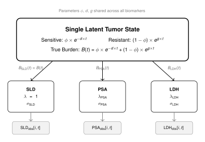

**Created:** February 2026
**Status:** Design Proposal

::: {.callout-tip}
## Related Pages
- See [Model Specification](model-specification.qmd) for the current SLD-based model
- See [Architecture](architecture.qmd) for code organization
- See [Onboarding Tutorial](onboarding-tutorial.qmd) for model background
:::

---

## Overview {#sec-psa-overview}

This document presents the plan to adapt the PIONEER tumor dynamics model from solid tumors (SLD-based) to metastatic castration-resistant prostate cancer (mCRPC) using PSA as the primary biomarker. Key enhancements include:

1. **Latent tumor burden model** with modality-specific observation equations
2. **Multi-biomarker support** for PSA, LDH, ALP, ctDNA, and future markers
3. **PCWG3-compliant progression criteria** replacing RECIST categories
4. **OS modeling** via the multistate illness-death model (already implemented, see [Model Specification](model-specification.qmd#sec-multistate))

---

## Problem Statement {#sec-psa-problem}

### Current Model

The current PIONEER model uses SLD (Sum of Longest Diameters) as the primary tumor measurement:

$$
\text{SLD}(t) = \text{SLD}_{\text{base}} \times \left[\phi \times e^{-d \times t} + (1-\phi) \times e^{g \times t}\right]
$$

Where:

- $\phi \in (0,1)$ = sensitive tumor fraction
- $d > 0$ = decrease rate (treatment effect)
- $g > 0$ = growth rate (resistance)

### Challenge

In prostate cancer, SLD measurements are unavailable. Instead, **Prostate Specific Antigen (PSA)** is the primary biomarker. PSA reflects tumor activity but may not directly correspond to tumor burden if resistant and sensitive cells produce PSA at different rates.

### Key Questions

1. **Latent Burden:** If we only have PSA observations, how do we obtain the latent tumor burden to pass to the hazard model?
2. **Multi-Biomarker:** If additional lab results become available (LDH, ALP, ctDNA), can we add parallel observation equations?
3. **PCWG3 Categories:** What are the PSA equivalents of RECIST categories (CR, PR, SD, PD)?

---

## Latent Tumor Burden Model {#sec-latent-burden}

### Core Architecture

The key insight is to separate the **latent tumor state** from the **observation model**:

{width=80%}

**Key concepts:**

- **$\phi$ (phi)**: The sensitive tumor fraction in terms of true tumor burden. Represents the proportion of tumor burden that is treatment-sensitive at baseline.
- **$\lambda$ (lambda)**: The relative production rate of each biomarker from resistant vs. sensitive cells. For example, $\lambda_{\text{PSA}} = \rho_{\text{resistant}} / \rho_{\text{sensitive}}$. When $\lambda = 1$, the observed biomarker directly reflects true tumor burden $B(t)$.

### Latent State-Space Model

**State Variables:**

$$
\begin{align}
x_s(t) &= \log(\text{sensitive burden}) \\
x_r(t) &= \log(\text{resistant burden})
\end{align}
$$

**Initial Conditions (at $t=0$):**

$$
\begin{align}
x_s(0) &= \log(\phi) \\
x_r(0) &= \log(1 - \phi)
\end{align}
$$

**Dynamics:**

$$
\begin{align}
x_s(t + \Delta t) &= x_s(t) - d \times \Delta t \\
x_r(t + \Delta t) &= x_r(t) + g \times \Delta t
\end{align}
$$

**Normalized Total Burden:**

$$
B(t) = e^{x_s(t)} + e^{x_r(t)} = \phi \times e^{-d \times t} + (1-\phi) \times e^{g \times t}
$$

This is mathematically identical to the current SLD model, reinterpreted as a latent tumor burden.

---

## Observation Models {#sec-observation-models}

### SLD Observation (Solid Tumors)

SLD is directly proportional to tumor burden ($\lambda = 1$):

$$
\log\left(\frac{\text{SLD}(t)}{\text{SLD}_{\text{base}}}\right) \sim \text{Normal}\left(\log(B(t)), \sigma^2_{\text{SLD}}\right)
$$

### PSA Observation (Prostate Cancer) {#sec-psa-observation}

PSA reflects tumor burden weighted by differential production rates. Let $\lambda = \rho_r / \rho_s$ be the ratio of PSA production rates (resistant to sensitive cells).

**General case ($\lambda \neq 1$):**

$$
B_{\text{PSA}}(t) \equiv \frac{\text{PSA}(t)}{\text{PSA}_{\text{base}}} = \frac{\phi \times e^{-d \times t} + \lambda \times (1-\phi) \times e^{g \times t}}{\phi + \lambda \times (1-\phi)}
$$

The denominator $\phi + \lambda \times (1-\phi)$ ensures $B_{\text{PSA}}(0) = 1$.

**Special case ($\lambda = 1$):**

$$
B_{\text{PSA}}(t) = \phi \times e^{-d \times t} + (1-\phi) \times e^{g \times t} = B(t)
$$

When $\lambda = 1$, the normalized PSA equals the true tumor burden. This is the assumption for Phase 1 implementation.

**Observation Model:**

$$
\log\left(\frac{\text{PSA}(t)}{\text{PSA}_{\text{base}}}\right) \sim \text{Normal}\left(\log(B_{\text{PSA}}(t)), \sigma^2_{\text{PSA}}\right)
$$

---

## The $\lambda$ Parameter and Identifiability {#sec-lambda}

### Apparent Sensitive Fraction

The PSA observation equation can be rewritten as:

$$
B_{\text{PSA}}(t) = \alpha_{\text{PSA}} \times e^{-d \times t} + (1 - \alpha_{\text{PSA}}) \times e^{g \times t}
$$

where:

$$
\alpha_{\text{PSA}} = \frac{\phi}{\phi + \lambda \times (1 - \phi)}
$$

This $\alpha_{\text{PSA}}$ is the **apparent sensitive fraction** — what the true sensitive fraction $\phi$ looks like when observed through PSA. It has the same mathematical role as $\phi$ in $B(t)$, but is a composite of $\phi$ and $\lambda$.

### Interpretation of $\lambda$

| Value | Interpretation |
|-------|----------------|
| $\lambda = 1$ | Equal PSA production; $\alpha_{\text{PSA}} = \phi$; $B_{\text{PSA}}(t) = B(t)$ |
| $\lambda > 1$ | Resistant cells produce more PSA; $\alpha_{\text{PSA}} < \phi$; PSA rises faster than tumor grows |
| $\lambda < 1$ | Resistant cells produce less PSA; $\alpha_{\text{PSA}} > \phi$; PSA underestimates resistant burden |

### Identifiability {#sec-identifiability}

When fitting the model to PSA data, we estimate $\alpha_{\text{PSA}}$, $d$, and $g$ directly. We cannot separately identify $\phi$ and $\lambda$ — only their composite $\alpha_{\text{PSA}}$.

| Data Available | What's Identifiable |
|----------------|---------------------|
| Single biomarker (SLD or PSA with $\lambda=1$) | $B(t), \phi, d, g$ |
| PSA only, $\lambda \neq 1$ | $B_{\text{PSA}}(t), \alpha_{\text{PSA}}, d, g$ (NOT $\phi, \lambda$ separately) |
| Both PSA + SLD | $B(t), B_{\text{PSA}}(t), \phi, \lambda, d, g$ |

The first row covers both SLD-only and PSA-only with $\lambda = 1$ because they are mathematically identical. This is why Phase 1 requires minimal changes to the existing model.

### Inverse Relationship

If $\lambda$ is known (e.g., from combined PSA + SLD data or external information), $\phi$ can be recovered:

$$
\phi = \frac{\alpha_{\text{PSA}} \times \lambda}{\alpha_{\text{PSA}} \times \lambda + (1 - \alpha_{\text{PSA}})}
$$

---

## Multi-Biomarker Extension {#sec-multi-biomarker}

### General Framework

For any biomarker $k$ with production ratio $\lambda_k$:

$$
B_k(t) = \frac{\phi \times e^{-d \times t} + \lambda_k \times (1-\phi) \times e^{g \times t}}{\phi + \lambda_k \times (1-\phi)}
$$

$$
\log\left(\frac{Y_k(t)}{Y_{k,\text{base}}}\right) \sim \text{Normal}\left(\log(B_k(t)), \sigma^2_k\right)
$$

### Prostate Cancer Biomarkers

| Biomarker | $\lambda$ Parameter | Clinical Relevance |
|-----------|-------------|-------------------|
| PSA | $\lambda_{\text{PSA}}$ | Primary marker, tumor activity |
| LDH | $\lambda_{\text{LDH}}$ | Tumor burden, tissue damage |
| ALP | $\lambda_{\text{ALP}}$ | Bone disease activity |
| ctDNA | $\lambda_{\text{ctDNA}}$ | Circulating tumor DNA |

### Architecture Diagram

{width=80%}

Each biomarker has its own $\lambda_k$ and $\sigma_k$ parameters, while the latent tumor dynamics ($\phi$, $d$, $g$) are shared. Multiple biomarkers with different $\lambda$ values help identify the true tumor burden $B(t)$.

---

## PCWG3 Progression Criteria {#sec-pcwg3}

### PCWG3 vs RECIST Comparison

| RECIST Category | SLD Criterion | PCWG3/PSA Analog | PSA Criterion |
|-----------------|---------------|------------------|---------------|
| **CR** | $\text{SLD} = 0$ | **PSA Undetectable** | $\text{PSA} < 0.1$ ng/mL |
| **PR** | $\geq 30\%$ decrease from baseline | **PSA50** | $\geq 50\%$ decrease from baseline |
| **SD** | Neither PR nor PD | **PSA Stable** | Neither PSA50 nor PSA-PD |
| **PD** | $\geq 20\%$ increase from nadir AND $\geq 5$mm | **PSA-PD** | $\geq 25\%$ AND $\geq 2$ ng/mL from nadir (confirmed) |

### PCWG3 PSA Progression Criteria (Scher et al. 2016)

**Scenario A: After PSA Decline from Baseline**

PSA-PD = TRUE if ALL of:

- $\frac{\text{PSA} - \text{nadir}}{\text{nadir}} \geq 0.25$
- $\text{PSA} - \text{nadir} \geq 2$ ng/mL
- Confirmed by second value $\geq 3$ weeks later

**Scenario B: No PSA Decline from Baseline**

PSA-PD = TRUE if ALL of:

- $t > 12$ weeks
- $\frac{\text{PSA} - \text{baseline}}{\text{baseline}} \geq 0.25$
- $\text{PSA} - \text{baseline} \geq 2$ ng/mL
- Confirmed by second value $\geq 3$ weeks later

### Key Differences from RECIST

| Aspect | RECIST | PCWG3 PSA |
|--------|--------|-----------|
| **Confirmation** | Not always required | Required ($\geq 3$ weeks) |
| **Early protection** | None | No PD before 12 weeks if no decline |
| **Absolute threshold** | 5 mm | 2 ng/mL |
| **Reference** | Nadir for PD, baseline for PR | Nadir (after decline) or baseline |

---

## PSA Covariates for Hazard Model {#sec-psa-covariates}

### Biomarker-Derived Covariates

The following covariates flow from the longitudinal model to the multistate hazard model:

| # | Covariate | Source | Time Nature | Transitions |
|---|-----------|--------|-------------|-------------|
| 1 | $\log(B_{\text{PSA}}(t))$ | Longitudinal model | Time-varying | $0\to 1, 0\to 2$ |
| 2 | $\log(d)$ | Longitudinal model | Time-invariant* | $0\to 1, 0\to 2, 1\to 2$ |
| 3 | $\log(g)$ | Longitudinal model | Time-invariant* | $0\to 1, 0\to 2, 1\to 2$ |
| 4 | Velocity $\frac{d}{dt} \log(B_{\text{PSA}})$ | Longitudinal model | Time-varying | $0\to 1, 0\to 2$ |
| 5 | PSA nadir | Derived | Time-varying | $1\to 2$ |
| 6 | Time to nadir | Derived | Time-varying | $1\to 2$ |
| 7 | Nadir ratio | Derived | Time-varying | $0\to 1, 0\to 2$ |
| 8+ | Non-tumor covariates | Baseline data | Time-invariant | All |

*Can be time-varying if AR(1) process noise is enabled.

### PSA Kinetics as Prognostic Markers

| PSA Metric | Prognostic Value | Evidence |
|------------|------------------|----------|
| PSA doubling time | $< 3$ months = poor prognosis | Multiple studies |
| PSA50 response | Correlates with OS | Phase 3 trials |
| PSA nadir | Deeper = better OS | Abiraterone, Enzalutamide |
| PSA velocity | Rising = higher death risk | PCWG3 |

::: {.callout-note}
## Redundancy Note
PSA doubling time $(\log(2)/g)$ and PSA half-life $(\log(2)/d)$ are monotonic transformations of $\log(g)$ and $\log(d)$ respectively. Since those are already included as covariates, adding doubling time or half-life would be redundant.
:::

---

## Implementation Phases {#sec-phases}

### Phase 1: PSA-Only Model ($\lambda = 1$)

**Scope:**

- Replace SLD with PSA throughout
- Implement PCWG3 progression criteria
- Keep current hazard model structure (single $0 \to 1$ transition)
- Assume $\lambda = 1$ (mathematically identical to current model)

**Changes:**

- Observation model: $\log(\text{PSA}/\text{PSA}_{\text{base}}) \sim \text{Normal}(\log(B(t)), \sigma)$
- Generated quantities: PCWG3 categories instead of RECIST
- Variable renaming: `log_sld` $\to$ `log_burden` or `log_psa`

**Deliverable:** Working PSA model for prostate cancer

### Phase 2: OS via Multistate Hazard Model

**Scope:**

- Enable transitions $0\to 2$ and $1\to 2$ in the multistate module
- PSA dynamics primarily drive $0\to 1$
- Death hazards ($0\to 2$, $1\to 2$) use PSA covariates + clinical factors

**Changes:**

- Enable `enable_ms_02 = 1`, `enable_ms_12 = 1` in targets configuration
- Add death time data
- Configure covariates for each transition

**Deliverable:** Multi-state model with explicit progression and death transitions

::: {.callout-note}
## Already Implemented
The multistate module infrastructure is already implemented in `stan/modules/multistate/`. Phase 2 requires enabling existing transitions and providing death data, not new Stan code. See [Model Specification](model-specification.qmd#sec-multistate).
:::

### Phase 3: Hierarchical $\lambda$ Parameter

**Scope:**

- Add $\lambda$ as hierarchical parameter
- Allows differential PSA production
- Use informative prior centered at $\lambda = 1$

**Changes:**

- New parameter: `lambda_psa` with prior $\log(\lambda) \sim \text{Normal}(0, 0.5)$
- Observation model: $\log(\text{PSA}/\text{PSA}_{\text{base}}) \sim \text{Normal}(\log(B_{\text{PSA}}(t)), \sigma)$

**Deliverable:** More flexible PSA model

### Phase 4: Multi-Biomarker Support

**Scope:**

- Support multiple biomarkers (PSA, LDH, ALP, ctDNA)
- Each biomarker has own $\lambda$ and $\sigma$
- Shared latent tumor dynamics

**Changes:**

- Array of $\lambda$ parameters: `lambda[n_biomarkers]`
- Multiple observation likelihoods
- Ragged data structure for different observation schedules

**Deliverable:** Unified multi-modal model

### Phase 5: Combined SLD + PSA (Future)

**Scope:**

- Support datasets with both imaging and PSA
- Identify true $\phi$ and $\lambda$ from combined data
- Use true $B(t)$ in hazard model

**Deliverable:** Fully unified model for any biomarker combination

---

## Information Flow {#sec-info-flow}

```
┌─────────────────────────────────────────────────────────────────────┐
│                      PSA DYNAMICS MODULE                            │
│                      (tr, frac, init)                               │
│                                                                     │
│  Outputs:                                                           │
│  - B_PSA(t): PSA-represented tumor burden over time                │
│  - d, g: Decrease and growth rates                                 │
│  - T₀₁: Progression time (from PCWG3 criteria)                     │
│  - Derived: nadir, time-to-nadir, nadir ratio, velocity            │
│                                                                     │
│  PRIMARY ROLE: Determine transition 0→1 (Progression)              │
└─────────────────────────────────────────────────────────────────────┘
                              │
                              │ Provides covariates
                              ▼
┌─────────────────────────────────────────────────────────────────────┐
│                 MULTI-STATE HAZARD MODULE                           │
│                 (modules/multistate/)                               │
│                                                                     │
│  Transition 0→1: Deterministic from PSA dynamics OR hazard model   │
│  Transition 0→2: Hazard with PSA covariates + clinical factors     │
│  Transition 1→2: Hazard with post-progression PSA + clinical       │
│                                                                     │
│  Outputs:                                                           │
│  - PFS = min(T₀₁, T₀₂)                                             │
│  - OS  = min(T₀₂, T₀₁ + T₁₂)                                       │
│  - PPS = T₁₂                                                        │
└─────────────────────────────────────────────────────────────────────┘
```

---

## Summary {#sec-psa-summary}

### Key Design Decisions

| Decision | Choice | Rationale |
|----------|--------|-----------|
| Latent state | Normalized burden $B(t)$ | Agnostic to observation modality |
| Phase 1 $\lambda$ | Fix at 1 | Identifiable, minimal changes |
| Progression | PCWG3 criteria | Clinical standard for prostate cancer |
| Hazard model | Multi-state (illness-death) | Separates progression from death |
| PSA role | Primary for progression, covariate for death | Matches clinical evidence |

### Advantages

1. **Unified framework**: Same latent dynamics, different observation models
2. **Future-proof**: Easy to add new biomarkers or imaging
3. **Clinically meaningful**: Multi-state model captures disease course
4. **Identifiable**: Clear separation of what can/cannot be estimated
5. **Backward compatible**: Phase 1 is mathematically identical to current model

### Open Questions

1. Should $\lambda$ vary by patient (hierarchical) or be population-level?
2. How to handle radiographic progression (rPFS) in addition to PSA-PFS?

---

## References {#sec-psa-references}

- **PCWG3 Guidelines:** Scher et al. (2016) "Trial Design and Objectives for Castration-Resistant Prostate Cancer", *Journal of Clinical Oncology*
- **Multi-State Models:** Putter, Fiocco, Geskus (2007) "Tutorial in biostatistics: competing risks and multi-state models", *Statistics in Medicine*
- **Current Model:** [Model Specification](model-specification.qmd)

---

::: {.related-pages}
## Related Pages

- [Model Specification](model-specification.qmd) - Current SLD-based model with multistate hazard
- [Architecture](architecture.qmd) - Code organization and multistate module structure
- [Onboarding Tutorial](onboarding-tutorial.qmd) - Model background and clinical context
- [Clinical Endpoints](../analysis/clinical-endpoints.qmd) - Current RECIST-based results
:::
