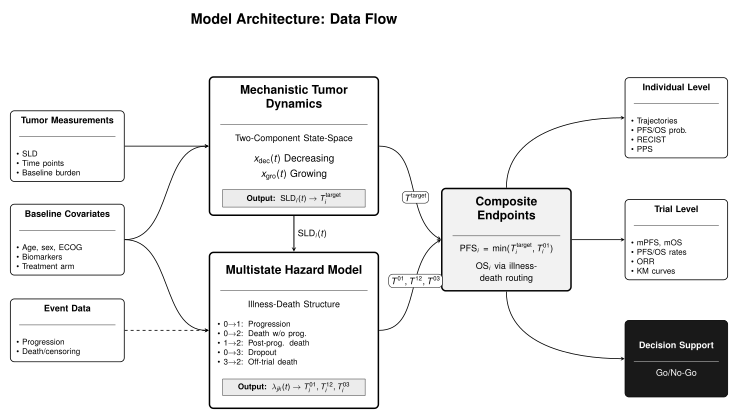

```{r}
#| label: setup
#| include: false

source("_setup.R")
```

<style>
.quarto-title-block {
  display: none;
}
</style>

::: {.column-page}
::: {.hero-section}
::: {.hero-content}
::: {.hero-text}
# SCLC-01 Forecasting

A digital twin Bayesian hierarchical model for forecasting tumor dynamics and progression-free survival in oncology trials.
:::

::: {.hero-image}

:::
:::
:::
:::

## Model Architecture

::: {.column-page}
{fig-align="center" width="100%"}
:::

## Model Performance

::: {style="display: flex; justify-content: center;"}
```{r}
#| label: home-confusion-sankey
#| fig-width: 7
#| fig-height: 5
#| echo: false
#| fig-align: center

oos_confusion_matrix_home <- tar_read(oos_confusion_matrix_ctdna_jan26, store = lfo_store)
plot_oos_confusion_sankey(oos_confusion_matrix_home) +
  labs(title = "Out-of-Sample Prediction Accuracy", subtitle = "Response Classification Flow")
```
:::

::: {.column-page}
## Quick Navigation

::: {.card-grid}

::: {.feature-card}
### [Getting Started](documentation/onboarding-tutorial.qmd)
New to the project? Start with our onboarding tutorial that guides you through the key concepts, model structure, and codebase.
:::

::: {.feature-card}
### [Model Architecture](documentation/model-architecture.qmd)
Model overview and structure, with links to detailed specifications for [tumor dynamics](documentation/tumor-dynamics-specification.qmd), [multistate model](documentation/multistate-specification.qmd), and [clinical endpoints](documentation/clinical-endpoints-specification.qmd).
:::

::: {.feature-card}
### [Clinical Endpoints](analysis/clinical-endpoints.qmd)
Key results including Overall Response Rate (ORR), Median Progression-Free Survival (PFS), and PFS at fixed timepoints.
:::

::: {.feature-card}
### [Survival Analysis](analysis/survival-analysis.qmd)
Kaplan-Meier survival curves for historical trials, SCLC forecasts, and PDL1-stratified analyses.
:::

::: {.feature-card}
### [Patient Dynamics](analysis/patient-dynamics.qmd)
Individual patient tumor trajectories, SLD forecasts, and RECIST classification predictions.
:::

::: {.feature-card}
### [Model Validation](analysis/model-validation.qmd)
Leave-future-out cross-validation, predictive accuracy assessment, and model comparison results.
:::

:::
:::

::: {.column-page}
## About This Analysis

This website presents results from the SCLC-01 longitudinal tumor analysis using a state-space model that captures:

- **Bi-exponential tumor dynamics**: Simultaneous treatment response (shrinkage) and resistance development (growth)
- **Hierarchical structure**: Information sharing across trials and patients
- **Independent competing risks**: Separate modeling of target lesion progression and other events
- **Clinical endpoints**: RECIST-based response classification and survival outcomes

## Documentation

| Document | Description |
|----------|-------------|
| [Onboarding Tutorial](documentation/onboarding-tutorial.qmd) | Step-by-step guide for new team members |
| [Model Architecture](documentation/model-architecture.qmd) | Model overview, notation, and structure |
| [Tumor Dynamics](documentation/tumor-dynamics-specification.qmd) | Tumor state-space model specification |
| [Multistate Model](documentation/multistate-specification.qmd) | Illness-death multistate model |
| [Clinical Endpoints](documentation/clinical-endpoints-specification.qmd) | PFS, OS, and derived endpoints |
| [Architecture](documentation/architecture.qmd) | System design and code organization |
| [AR(1) Process Noise](documentation/ar1-process-noise.qmd) | Time-varying rate implementation |

## Analysis Results

| Section | Description |
|---------|-------------|
| [Data Exploration](analysis/data-exploration.qmd) | Data overview and exploratory analysis |
| [Clinical Endpoints](analysis/clinical-endpoints.qmd) | ORR, median PFS, PFS-n results |
| [Survival Analysis](analysis/survival-analysis.qmd) | Kaplan-Meier curves and forecasts |
| [Parameter Inference](analysis/parameter-inference.qmd) | Population and patient-level parameters |
| [Patient Dynamics](analysis/patient-dynamics.qmd) | Individual tumor trajectories |
| [Model Validation](analysis/model-validation.qmd) | Cross-validation and accuracy |
| [Diagnostics](analysis/diagnostics.qmd) | MCMC sampling diagnostics |
| [DCO Comparisons](comparisons/dco-comparisons.qmd) | Data cutoff comparison analysis |

## Key References

- Stein, W. D., et al. (2008). "Tumor Growth Rates Derived from Data for Patients in a Clinical Trial Correlate Strongly with Patient Survival: A Novel Strategy for Evaluation of Clinical Trial Data." *The Oncologist*.
- RECIST 1.1 guidelines for tumor response assessment
:::
