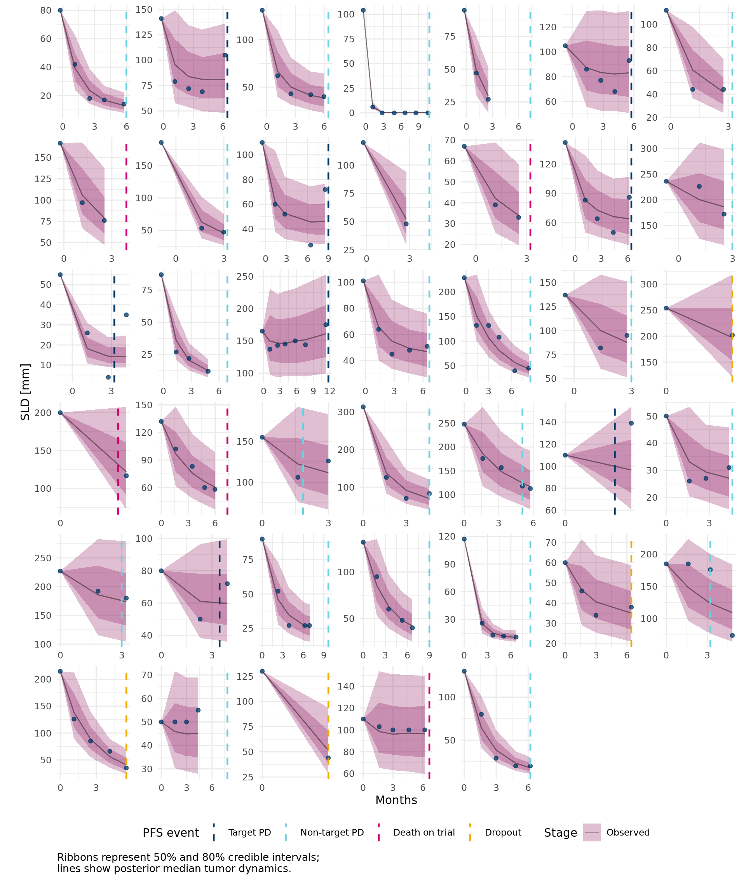
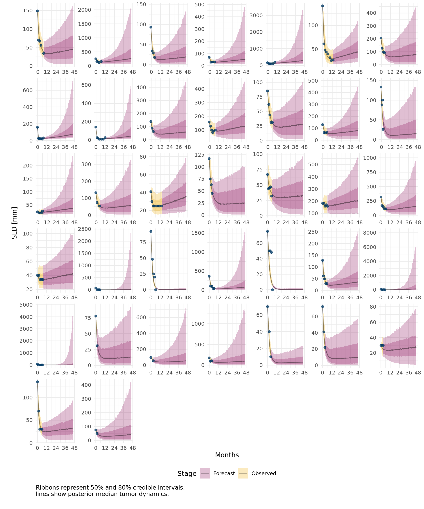
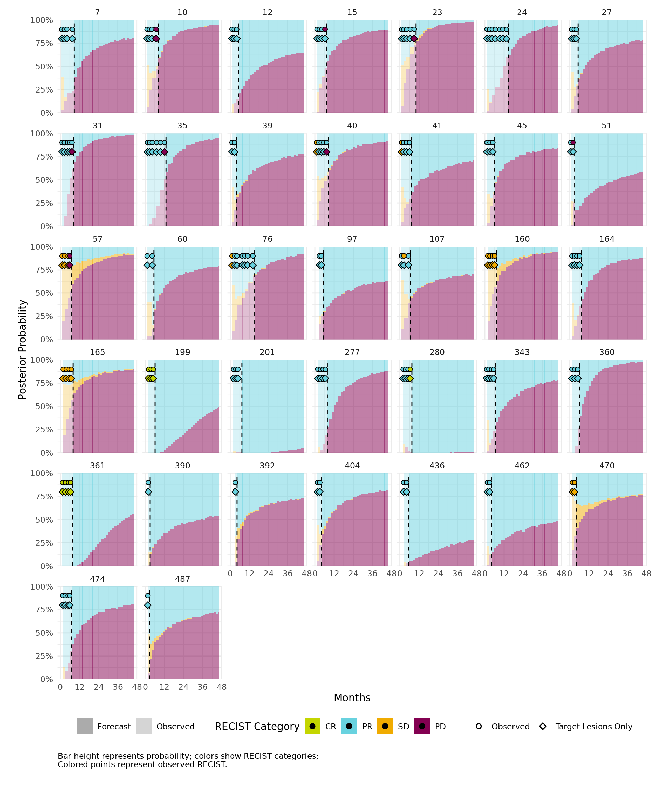
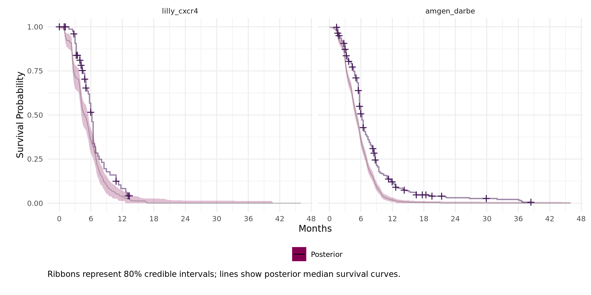
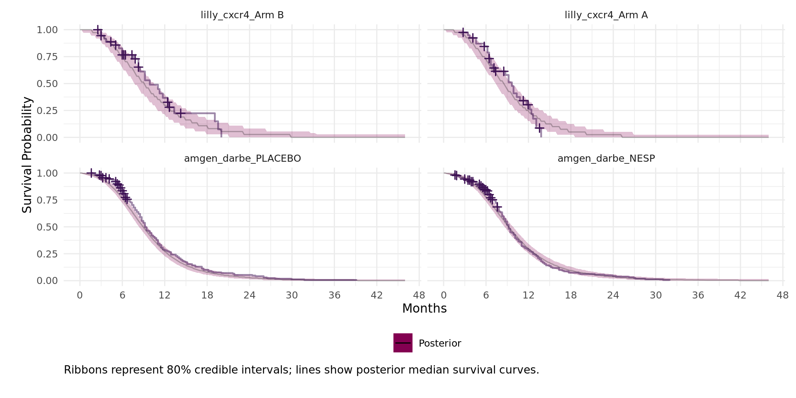
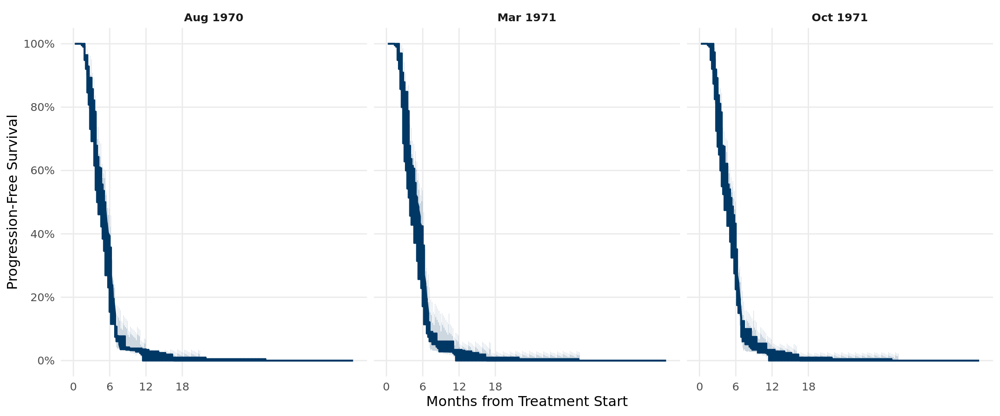
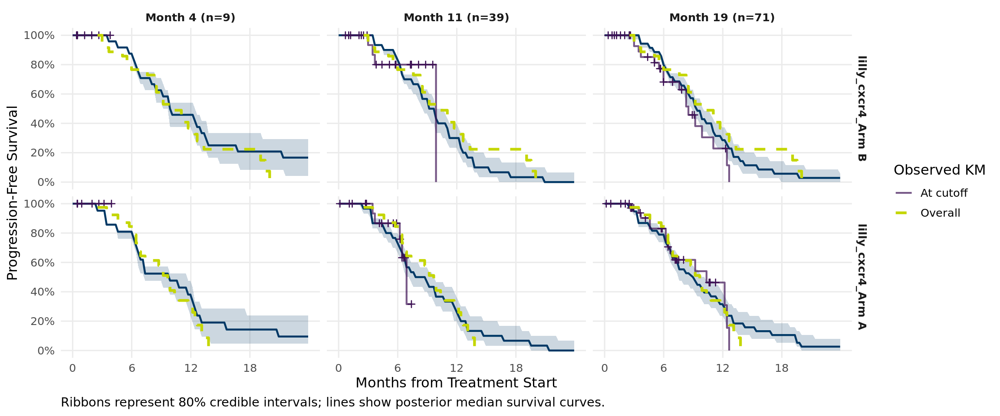
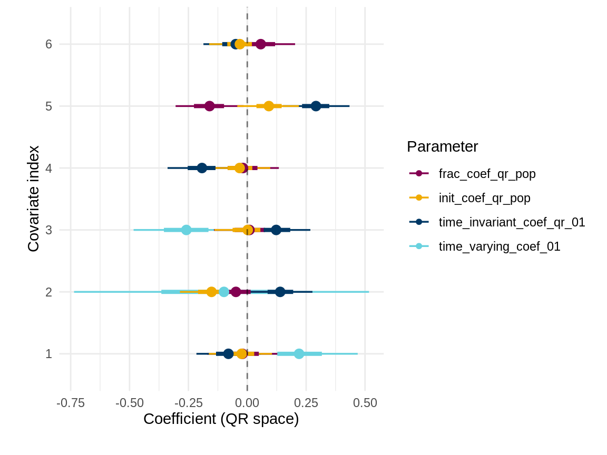
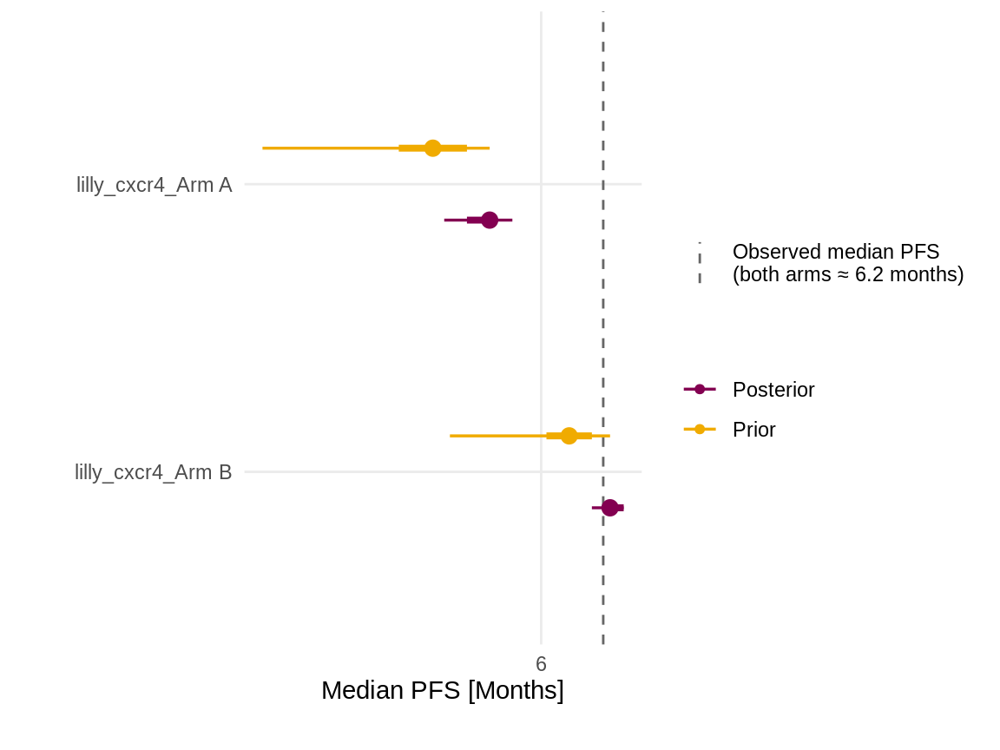
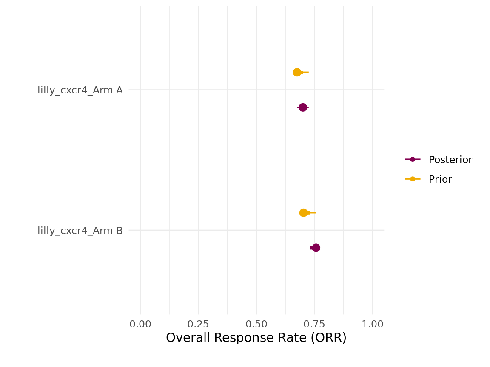

## Introduction {#sec-introduction}

<!-- The problem: predicting survival from immature trial data -->

Modern oncology trials must make high-stakes decisions -- dosage, patient cohort, and phase III go/no-go -- long before survival data matures. At a typical interim data cut-off (DCO), tumour and lab measurements are more abundant than indications about progression-free survival (PFS) and overall survival (OS) that remain heavily censored. What is needed is a model that can incorporate longitudinal measurements to forecast what the survival curves will look like at the final analysis, quantify how uncertain that forecast is, and transfer what it learns from other trials.

<!-- Related work -->

A substantial body of work has addressed this problem from different angles. The starting point for any longitudinal-tumour-to-survival framework is the empirical observation that tumour size kinetics correlate strongly with patient survival, and that this correlation is captured well by a two-exponential "decrease + growth" decomposition. Stein and colleagues introduced the formulation in advanced prostate cancer [@stein2008; @stein2011], showing that the growth-rate constant in particular is a strong correlate of OS. @wang2009 extended the framework to non-small-cell lung cancer (NSCLC). Claret and co-authors [@claret2009; @claret2012] turned the framework into a forecasting tool, demonstrating that Phase II tumour dynamics can be combined with a parametric OS submodel to predict Phase III OS, with calibration successes in colorectal and NSCLC contexts. @bruno2014 consolidated this body of work into a methodological review, and @bruno2020 argued explicitly for tumour-dynamic modelling as the standard supporting tool for go/no-go and dose-decision use-cases. Tumour-growth-inhibition (TGI) modelling — typically the decrease/growth two-exponential framework above, fitted to Phase II SLD data and used to predict Phase III OS — is now the dominant longitudinal-tumour-to-survival paradigm in pharmacometrics. These early implementations follow a two-stage workflow: fit dynamics first, then use derived summary statistics (e.g. growth rate, time to nadir, week-8 SLD) as covariates in a downstream survival model.

<!-- Joint methodology: latent variable + endogeneity -->

The natural starting point for survival analysis is the Cox proportional-hazards model, fitted with treatment arm and baseline covariates. Extending it to incorporate a longitudinal biomarker like SLD requires the time-varying-covariate form. Doing so correctly is, however, non-trivial for two reasons. First, the observed SLD is a noisy measurement of the patient's true tumour trajectory; plugging in the observed values as a covariate attenuates the estimated SLD–hazard association in proportion to the measurement noise — a direct errors-in-variables problem. Second, a patient's unmeasured characteristics — intrinsic disease aggressiveness, treatment sensitivity, immune competence — jointly determine both their tumour dynamics and their risk of progression and death. Any model that omits this shared latent structure is misspecified: the SLD covariate absorbs variation that rightly belongs to the unmeasured individual, and the resulting coefficient is inconsistent. The two-stage TGI workflow compounds both problems — summary statistics derived from a first-stage kinetic fit are treated as fixed inputs in the survival stage, inheriting the measurement noise of the SLD data and discarding uncertainty about the kinetic parameters themselves. The principled fix is a *joint longitudinal-survival* model: introduce the biomarker's underlying latent trajectory as a shared patient-level latent variable, and let both the longitudinal observations and the survival hazard depend on it simultaneously. The hazard then conditions on the smooth, noise-free latent state; the shared patient parameters are informed by both the SLD record and the event history at once; and the misspecification from omitting unmeasured individual heterogeneity is eliminated by construction. The textbook treatment is @rizopoulos2012, with @hickey2016 reviewing extensions to multiple longitudinal outcomes and competing risks.

<!-- TGI papers that adopt the joint-model architecture -->

A handful of TGI papers have adopted this joint-model architecture explicitly. These models retain the hierarchical (mixed-effects) tumour submodel — each patient has their own kinetic parameters drawn from a population distribution — but couple it to the survival submodel through the shared latent trajectory rather than through plug-in summaries. @ribba2014 reviews the underlying mixed-effects methodology across the Simeoni [@simeoni2004], Claret [@claret2009], Stein [@stein2008] and Wang [@wang2009] families. @tardivon2019 fit a population NLME tumour-size model jointly with an OS submodel in atezolizumab-treated urothelial carcinoma. @desmee2017 introduce Hamiltonian Monte Carlo Bayesian inference for the same joint structure in metastatic prostate cancer. In the immuno-oncology setting specifically, @kerioui2020 develop a Bayesian HMC joint model with a tumour-size submodel feeding an OS hazard; @kerioui2022 provides a non-technical introduction.

<!-- Multistate survival models in oncology -->

Multistate (progression-death) extensions of competing-risks survival have been used extensively in chronic-disease epidemiology and, increasingly, in oncology, where post-progression survival is itself of clinical interest [@putter2007; @meiramachado2009]. The framework is sometimes called *illness-death* in biostatistics, although in oncology trials all patients are already ill at enrolment and the relevant transition is from controlled to progressive disease. Modelling progression and death as separate transitions has two practical advantages over a single OS hazard: it lets the data speak to clinically distinct mechanisms — early progression, direct death without prior progression, and post-progression death have different time-courses and different covariate dependencies — and it enables forecasting the full PFS–OS joint distribution rather than each endpoint in isolation.

<!-- Gaps in the existing literature -->

Despite the maturity of each strand above, several gaps remain. First, existing tumour-dynamics-to-survival frameworks feed the dynamics into a *single* hazard (typically OS); they cannot express that tumour features affect progression, death without progression, and post-progression death differently — yet these are clinically distinct mechanisms. Second, most published work fits the tumour model first, then plugs the fitted trajectories into a survival model; this two-stage approach ignores the feedback from event data to the dynamics and underestimates uncertainty. Third, trial-level pooling — sharing information across historical and ongoing trials rather than handling each independently via ad-hoc meta-analysis — is rarely built into the framework as a first-class component. Fourth, endpoints (PFS, OS, ORR) are typically computed from point estimates of upstream parameters rather than propagated through the full posterior.

<!-- Our contribution: PIONEER -->

We present PIONEER^[Predictive Intelligence for ONcology Early Evaluation and Response.], a framework built to close these gaps. The model couples a *mechanistic* two-component state-space submodel of longitudinal tumour size (sum of longest diameters, SLD) to a *multistate proportional-hazard* submodel for the clinical events of interest inside a single Bayesian hierarchical framework. All clinical endpoints — target lesion progression, multistate PFS, OS, objective response rate — are derived in the same posterior-predictive pass from the joint posterior, so every reported quantity automatically inherits the model's full uncertainty. The mechanistic submodel feeds the multistate submodel through a shared *latent* trajectory: the latent SLD, decrease rate and growth rate enter the multistate hazards as time-varying covariates, and because both submodels depend on the same patient-level latent parameters, the event data refines the inferred trajectory at the same time as the SLD data does. There is no two-stage plug-in.

The novelty has five facets:

- **Transition-specific tumour covariates.** Each transition in the illness-death model has its own tumour-derived covariate vector with transition-specific coefficients, allowing the model to express that growth rate strongly predicts progression hazard but only weakly affects post-progression mortality — a distinction single-hazard joint models cannot make.
- **Joint latent state.** The decrease/growth decomposition is the latent state of a state-space model fitted jointly with the multistate submodel — not a two-stage plug-in — avoiding both the attenuation and the omitted-frailty misspecification of plug-in approaches and correctly propagating kinetic uncertainty into every downstream endpoint.
- **Correlated per-transition frailty.** Each transition carries its own patient-level frailty, and the frailty terms are modelled jointly as a multivariate normal with an estimated correlation structure, capturing residual individual heterogeneity unexplained by the tumour bridge and revealing cross-transition dependence in unmeasured patient characteristics.
- **Multi-trial hierarchy.** Patients are nested within arms within trials in a single hierarchical model; population-level parameters are shared across trials by construction, so fitting on multiple trials simultaneously yields cross-trial borrowing without a separate meta-analytic step. Covariate effects are entered via QR-decomposed design matrices with elicited priors mapped through the rotation.
- **Full-posterior endpoint propagation.** All endpoints are read off the joint posterior, producing both unconditional ("super-population") and observed-data-conditioned predictive distributions without re-fitting.

<!-- Inference + forward simulation pipeline -->

PIONEER is built around a *backward inference, forward simulation* pipeline. The backward step performs joint Bayesian inference over the entire trial — latent tumour trajectories, multistate hazards and the population hierarchy, all in a single posterior — using every patient's observed SLD record and event history through the data cut-off. The forward step then propagates each posterior draw past the cut-off, extending the latent trajectory, accumulating the multistate hazards, and producing posterior predictive distributions for mature-DCO Kaplan–Meier curves, response rates, and any other endpoint of interest. Inference and forecasting share the same parameter uncertainty by construction; there is no re-fitting and no plug-in step between them. The credibility of the forward simulation rests on two pillars: the mechanistic parametric structure of the tumour submodel, whose decrease/growth decomposition constrains the shape of the extrapolated trajectory; and the population hierarchy, which — when historical trials are included — encodes what kinetic profiles and hazard trajectories tend to look like at maturities the target trial has not yet reached.

## Model {#sec-model}

This section specifies the joint model in full. We organise the description around the data flow shown in @fig-model-overview: patient-level inputs (longitudinal SLD, baseline covariates, event histories) are routed through two coupled submodels — a mechanistic state-space submodel for the SLD trajectory (@sec-mechanistic) and a multistate hazard submodel for the clinical events (@sec-multistate) — linked by a small set of time-varying tumour-derived covariates (the *bridge*). All clinical endpoints are read off the joint posterior in a single posterior-predictive pass, with no two-stage plug-in.

::: {#fig-model-overview}
{width=100%}

Joint model overview. Patient-level inputs (left) feed two coupled submodels (centre): the mechanistic state-space submodel of SLD dynamics, and the multistate illness-death-with-dropout hazard submodel. The tumour-derived time-varying covariate vector $\mathbf{W}_i(t)$ is the explicit *bridge* through which the mechanistic submodel feeds the hazards; the dashed arrow indicates the joint likelihood, which lets the event data refine the latent state's posterior. Endpoints (right) are deterministic functions of the joint posterior.
:::

### Notation and setup {#sec-notation}

We index patients by $i = 1, \dots, N$. The time clock is the patient's *study week*, an integer-valued grid in which week $1$ denotes the first week on treatment; non-positive weeks ($t \le 0$) correspond to the pre-treatment screening window. Each patient $i$ contributes a vector of baseline covariates $\mathbf{x}_i \in \mathbb{R}^p$, a set of SLD assessments at visit weeks $\mathcal{V}_i \subset \mathbb{Z}_{>0}$ (ragged across patients), and an event history. We will write $y_i(t)$ for the SLD measurement at visit week $t \in \mathcal{V}_i$ — a single scalar per visit — so that $y_i(\cdot)$ is a function defined only on the patient's visit weeks. The event history takes one of four mutually exclusive terminal states by the data cut-off: alive and progression-free (state $0$), progressed (state $1$), dead (state $2$), or off-trial without death (state $3$). Transitions between these states are written $j \to k$; the five admissible transitions are $0 \to 1$, $0 \to 2$, $1 \to 2$, $0 \to 3$ and $3 \to 2$ (see @fig-multistate-diagram).

For each patient we identify a single *baseline visit*, defined as the last SLD assessment in the pre-treatment screening window. We write $t_i^{\mathrm{bl}} \le 0$ for the week of patient $i$'s baseline visit, and $y_i^{\mathrm{bl}} \equiv y_i(t_i^{\mathrm{bl}})$ for the SLD measurement at that visit. We define the *normalised burden* using the patient's *latent* SLD trajectory $\mathrm{SLD}_i(t)$ — the true, unobserved tumour size at week $t$ that underlies the noisy visit measurements $y_i(t)$, $t \in \mathcal{V}_i$, and is modelled explicitly in @sec-mechanistic:
$$
B_i(t) \;=\; \frac{\mathrm{SLD}_i(t)}{y_i^{\mathrm{bl}}},
$$ {#eq-sld-normalised}
so that the latent burden at the baseline visit, $B_i(t_i^{\mathrm{bl}})$, is the ratio of the latent SLD to the observed baseline SLD at that visit; up to baseline measurement noise, $B_i(t_i^{\mathrm{bl}}) \approx 1$. The symbol $B$ is a mnemonic for *burden*; values of $B_i(t)$ above $1$ correspond to a tumour size larger than baseline, values below $1$ to a tumour size smaller than baseline. The observed baseline $y_i^{\mathrm{bl}}$ enters only as a known offset on the normaliser — we *condition* on it as the patient's reference scale rather than modelling it as a noisy outcome of the dynamics — so the model is invariant to overall tumour-size scale and the dynamics are not confounded with cohort-level differences in initial disease burden. The same definition generalises naturally to settings where SLD is replaced by another biomarker (e.g., PSA in prostate cancer; @sec-applications).

Trial membership is denoted $s[i] \in \{1, \dots, S\}$ when relevant, where $S$ is the number of trials in the analysis.

### Mechanistic tumour-dynamics submodel {#sec-mechanistic}

#### Latent two-component representation {#sec-mech-states}

We model the normalised burden $B_i(t)$ as the sum of two latent components — a *decreasing* component $D_i(t) > 0$ representing burden that responds to treatment, and a *growing* component $G_i(t) > 0$ representing burden that is refractory or post-progression:
$$
B_i(t) \;=\; D_i(t) \;+\; G_i(t).
$$ {#eq-sld-decomp}
We emphasise that this is a *phenomenological* decomposition: $D_i$ and $G_i$ are not claimed to recover real clonal subpopulations. The interpretation is operational — $D_i$ tracks the part of the burden that contracts under therapy and $G_i$ the part that expands. The case for the decomposition is forecasting performance and parameter transportability, not a mechanistic biological claim.

Like $B_i(t)$ itself, $D_i(t)$ and $G_i(t)$ are dimensionless contributions to the normalised burden, and at baseline they sum to one. The dynamics of $D_i$ and $G_i$ — exponential decay and exponential growth, respectively — are most naturally written on the log scale, and inference is performed in terms of $\log D_i$ and $\log G_i$ (next subsection); we keep the *names* $D_i, G_i$ on the linear scale to match $B_i$ and write logs explicitly where they apply.

#### Dynamics {#sec-mech-dynamics}

The two components evolve via patient-specific *change rates*: a positive rate of contraction $r^{\mathrm{dec}}_i$ for the decreasing component and a positive rate of expansion $r^{\mathrm{gro}}_i$ for the growing component:
$$
\begin{aligned}
\frac{\mathrm{d}\log D_i(t)}{\mathrm{d} t} &\;=\; -\, r^{\mathrm{dec}}_i, \\
\frac{\mathrm{d}\log G_i(t)}{\mathrm{d} t} &\;=\; +\, r^{\mathrm{gro}}_i,
\end{aligned}
$$ {#eq-mech-ode}
i.e. exponential decay of $D_i(t)$ at rate $r^{\mathrm{dec}}_i$ and exponential growth of $G_i(t)$ at rate $r^{\mathrm{gro}}_i$. Substituting (@eq-mech-discrete) into (@eq-sld-decomp) gives the closed-form trajectory
$$
B_i(t)
\;=\;
\pi_i\,\mathrm{e}^{-r^{\mathrm{dec}}_i\,(t - t_i^{\mathrm{bl}})}
\;+\;
(1 - \pi_i)\,\mathrm{e}^{+r^{\mathrm{gro}}_i\,(t - t_i^{\mathrm{bl}})},
$$ {#eq-sld-twoexp}
where $\pi_i$ is the patient's initial decreasing fraction. This is the familiar two-exponential SLD trajectory of the Stein/Claret/Bruno tradition [@stein2008]; inference is performed on $\log D_i, \log G_i$ rather than on (@eq-sld-twoexp) as a regression target.

<!-- TODO(Lu/Karim): Karim's version below — discuss "deterministic consequence" phrasing (with AR(1) process noise it's stochastic, not deterministic):
where $\pi_i$ is the patient's initial decreasing fraction (introduced in @sec-mech-initial). This is the familiar two-exponential SLD trajectory of the Stein/Claret/Bruno tradition (@stein2008; Claret 2009; Bruno 2014); we recover it as a deterministic consequence of the latent-component formulation, but inference is performed on $\log D_i, \log G_i$ rather than on (@eq-sld-twoexp) as a regression target.
-->

In the primary configuration, the change rates are *constant in time* and patient-specific; both rates depend on baseline covariates through their decomposition into a magnitude and a balance, described next.[^ar1-note]

[^ar1-note]: The framework supports a natural extension in which the constant rates of (@eq-mech-discrete) are replaced with smoothly time-varying versions, generated by adding a stationary AR(1) process to each log-rate at the population (or, optionally, patient) level. The AR(1) mean is the patient's $\log r^{\mathrm{dec}}_i$ or $\log r^{\mathrm{gro}}_i$ from (@eq-rate-pair); the AR(1) innovations capture smooth deviations of the realised rate from its time-averaged value over the course of follow-up. We do not exercise this option in the primary analysis because (i) the observation density already accommodates measurement error and (ii) the smoothed posterior trajectories from the constant-rate model are visibly close to the observed SLD curves in the case study.

The discretisation we use for inference puts $\log D_i$ and $\log G_i$ on a weekly grid running from $t_i^{\mathrm{bl}}$ to a patient-specific horizon $T_i$:
$$
\begin{aligned}
\log D_i(t) &\;=\; \log D_i(t_i^{\mathrm{bl}}) - r^{\mathrm{dec}}_i \cdot (t - t_i^{\mathrm{bl}}), \\
\log G_i(t) &\;=\; \log G_i(t_i^{\mathrm{bl}}) + r^{\mathrm{gro}}_i \cdot (t - t_i^{\mathrm{bl}}),
\end{aligned}
$$ {#eq-mech-discrete}

i.e. the log-components are linear in elapsed time since baseline when the rates are constant; equivalently, $D_i$ and $G_i$ themselves are exponential in $t - t_i^{\mathrm{bl}}$. The full latent trajectory $\{(D_i(t), G_i(t))\}_{t \ge t_i^{\mathrm{bl}}}$ is therefore determined by three patient-level quantities — the initial split between the two components at the baseline visit and the two change rates — plus the observed baseline measurement $y_i^{\mathrm{bl}}$.

#### Initial state {#sec-mech-initial}

By construction, $B_i(t_i^{\mathrm{bl}}) = 1$. The initial allocation between the two components is parameterised by the *initial decreasing fraction* $\pi_i \in (0, 1)$:
$$
D_i(t_i^{\mathrm{bl}}) = \pi_i, \qquad G_i(t_i^{\mathrm{bl}}) = 1 - \pi_i.
$$ {#eq-mech-initial-split}
which satisfies $D_i(t_i^{\mathrm{bl}}) + G_i(t_i^{\mathrm{bl}}) = 1$ as required by (@eq-sld-decomp). On the log scale used for inference, this reads $\log D_i(t_i^{\mathrm{bl}}) = \log \pi_i$ and $\log G_i(t_i^{\mathrm{bl}}) = \log(1-\pi_i)$.

We work with $\pi_i$ on the logit scale,
$$
\eta^{\mathrm{init}}_i \;=\; \mathrm{logit}(\pi_i)
\;=\; \alpha^{\mathrm{init}} + \alpha^{\mathrm{init}}_{s[i]} + \alpha^{\mathrm{init}}_i + \mathbf{x}_i \cdot \boldsymbol{\beta}^{\mathrm{init}},
$$ {#eq-init-linpred}
where $\alpha^{\mathrm{init}}$ is a population-level intercept, $\alpha^{\mathrm{init}}_{s[i]} \sim \mathtt{Normal}(0, \tau^{\mathrm{init}}_{\mathrm{arm}}{}^2)$ a trial-arm deviation, $\alpha^{\mathrm{init}}_i \sim \mathtt{Normal}(0, \tau^{\mathrm{init}}_{\mathrm{patient}}{}^2)$ a patient-level deviation, and $\boldsymbol{\beta}^{\mathrm{init}}$ a vector of population-level covariate coefficients. Large positive $\eta^{\mathrm{init}}_i$ corresponds to a patient who starts almost entirely in the responsive compartment (and therefore exhibits a large early decrease before any growing-component contribution becomes visible); large negative $\eta^{\mathrm{init}}_i$ corresponds to a patient whose SLD trajectory is dominated by growth from week $1$.

#### Patient-level change rates {#sec-mech-rates}

Rather than parameterise $r^{\mathrm{dec}}_i$ and $r^{\mathrm{gro}}_i$ directly, we decompose each patient's rate pair into a *magnitude* (total log-rate $\eta^{\mathrm{tot}}_i$) and a *balance* ($\eta^{\mathrm{bal}}_i$, logit-scale allocation between decrease and growth):
$$
\begin{aligned}
\log r^{\mathrm{dec}}_i &\;=\; \eta^{\mathrm{tot}}_i \;+\; \log \sigma(\eta^{\mathrm{bal}}_i), \\
\log r^{\mathrm{gro}}_i &\;=\; \eta^{\mathrm{tot}}_i \;+\; \log\!\big(1 - \sigma(\eta^{\mathrm{bal}}_i)\big),
\end{aligned}
$$ {#eq-rate-pair}
where $\sigma(\cdot)$ is the standard logistic function. Equivalently, the *decreasing fraction of the rate magnitude* is $\sigma(\eta^{\mathrm{bal}}_i) \in (0,1)$, and $1 - \sigma(\eta^{\mathrm{bal}}_i)$ is the growing fraction; large positive $\eta^{\mathrm{bal}}_i$ describes a patient whose dynamics are dominated by contraction, large negative $\eta^{\mathrm{bal}}_i$ a patient whose dynamics are dominated by expansion. The decomposition is bijective: given $r^{\mathrm{dec}}_i, r^{\mathrm{gro}}_i$ we recover
$$
\begin{aligned}
\eta^{\mathrm{tot}}_i &\;=\; \log(r^{\mathrm{dec}}_i + r^{\mathrm{gro}}_i), \\
\eta^{\mathrm{bal}}_i &\;=\; \log(r^{\mathrm{dec}}_i / r^{\mathrm{gro}}_i).
\end{aligned}
$$

The magnitude and balance parameters carry the population-, covariate-, and patient-level structure. We let
$$
\begin{aligned}
\eta^{\mathrm{tot}}_i &\;=\; \alpha^{\mathrm{tot}} \;+\; \alpha^{\mathrm{tot}}_{s[i]} \;+\; \alpha^{\mathrm{tot}}_i, \\
\eta^{\mathrm{bal}}_i &\;=\; \alpha^{\mathrm{bal}} \;+\; \alpha^{\mathrm{bal}}_{s[i]} \;+\; \alpha^{\mathrm{bal}}_i \;+\; \mathbf{x}_i \cdot \boldsymbol{\beta}^{\mathrm{bal}},
\end{aligned}
$$ {#eq-rate-linpred}
with population-level intercepts $\alpha^{\mathrm{tot}}, \alpha^{\mathrm{bal}}$, trial-arm deviations $\alpha^{\mathrm{tot}}_{s[i]} \sim \mathtt{Normal}(0, \tau^{\mathrm{tot}}_{\mathrm{arm}}{}^2)$ and $\alpha^{\mathrm{bal}}_{s[i]} \sim \mathtt{Normal}(0, \tau^{\mathrm{bal}}_{\mathrm{arm}}{}^2)$, patient-level deviations $\alpha^{\mathrm{tot}}_i \sim \mathtt{Normal}(0, \tau^{\mathrm{tot}}_{\mathrm{patient}}{}^2)$ and $\alpha^{\mathrm{bal}}_i \sim \mathtt{Normal}(0, \tau^{\mathrm{bal}}_{\mathrm{patient}}{}^2)$, and a covariate coefficient vector $\boldsymbol{\beta}^{\mathrm{bal}}$ on the balance only (priors discussed in @sec-priors). Notice that baseline covariates do **not** enter the magnitude: they affect the *balance* between contraction and growth but not the overall speed of the dynamics.

This restricted covariate structure — covariates on the balance and on the initial split, not on the magnitude — is a deliberate identification choice for the case study. With covariates entering all three of $\eta^{\mathrm{tot}}_i, \eta^{\mathrm{bal}}_i, \eta^{\mathrm{init}}_i$ unrestricted, the resulting three coefficient vectors are poorly separated when SLD trajectories are short or noisy: a patient who shrinks quickly looks the same as a patient with a fast magnitude and a balance pushed entirely toward decrease. Routing covariates through balance and initial split, while leaving magnitude to a population mean plus arm and patient deviations, has empirically been the most identifiable parameterisation across the trials we have fitted; we expand on this in @sec-priors.

The covariate vector $\mathbf{x}_i$ in (@eq-init-linpred) and (@eq-rate-linpred) is the same throughout. In the ctDNA configuration of the case study, $\mathbf{x}_i$ comprises clinical baseline covariates (number of prior lines of therapy, PD-L1 high/low, histology, age, sex, ECOG, smoking status, race, sites of metastasis, tumour stage), routine laboratory baselines (LDH, albumin, neutrophils, monocytes, haematocrit, neutrophil-to-lymphocyte ratio, AST, GGT, ALP, chloride), and a baseline ctDNA score. To deal with the high dimensionality and correlation among these covariates we enter them through QR-rotated design matrices, with elicited priors mapped through the QR rotation; this is discussed in detail in @sec-priors.

#### Observation model {#sec-mech-observation}

At each post-baseline visit week $t \in \mathcal{V}_i$ with $t > t_i^{\mathrm{bl}}$, we use a Gaussian observation density on the log scale:
$$
\log\!\frac{y_i(t)}{y_i^{\mathrm{bl}}} \;\sim\; \mathtt{Normal}\!\big(\log B_i(t), \; \sigma_y^2\big),
$$ {#eq-obs-density}
with observation scale $\sigma_y$ shared across patients and visits. The baseline visit itself is excluded from the likelihood: because we condition on $y_i^{\mathrm{bl}}$ as the normaliser in (@eq-sld-normalised), the baseline observation defines the patient's reference scale and is not modelled as a noisy outcome of the dynamics. The log-scale Gaussian assumption is consistent with the multiplicative measurement-error structure of RECIST 1.1 — multiple target lesions, inter-reader variability, and discreteness of the sum-of-diameters all contribute proportionally to the size of the lesions being measured — and yields tractable left-censoring under the limit of detection (below). A heavier-tailed alternative (Student-$t$) would be a natural robustness extension; we discuss this briefly in @sec-discussion.

When SLD falls below the assay limit of detection (in practice, when all target lesions disappear so that $y_i(t) = 0$ would be reported), the observation is treated as left-censored at the limit-of-detection value $y^{\mathrm{LoD}}$, with the corresponding contribution to the likelihood being the Gaussian CDF at $\log(y^{\mathrm{LoD}} / y_i^{\mathrm{bl}})$ rather than the density. This handling of LoD is essential in IO trials where deep responses are common; treating the absence as a measurement of zero or omitting the visit week both introduce bias.

#### Outputs that flow to the multistate {#sec-mech-outputs}

For each posterior draw, the mechanistic submodel delivers for every patient and every week: the latent burden $B_i(t)$, and the change rates $r^{\mathrm{dec}}_i, r^{\mathrm{gro}}_i$. These are the inputs to the time-varying covariate bridge $\mathbf{W}_i(t)$ defined in @sec-multistate.

### Multistate proportional-hazard submodel {#sec-multistate}

#### State graph and time scales {#sec-ms-states}

The multistate submodel governs the stochastic clinical events. Each patient occupies one of four states at every week $t$: alive and progression-free (state $0$), progressed and alive (state $1$), dead (state $2$, absorbing), or off-trial without observed death (state $3$); the five admissible transitions between these states, together with their time-scale conventions, are shown in @fig-multistate-diagram below. Each transition has its own intensity, with its own time scale and its own dependence on covariates and on the latent burden trajectory.

::: {#fig-multistate-diagram}
{width=85%}

Multistate state graph with the five transition intensities used in the case study. Three transitions out of state $0$ ($0\to 1$ progression, $0\to 2$ direct death, $0\to 3$ dropout) use clock-forward time $t$. The two transitions into state $2$ from non-zero source states ($1\to 2$ post-progression death, $3\to 2$ off-trial death) use sojourn time $u_1 = t - T_{01}$ and $u_3 = t - T_{03}$ respectively (semi-Markov; the clock resets on entry into the source state). State $3$ is dashed to mark its off-trial status; state $2$ is filled to mark it as the absorbing terminal state.
:::

The case-study configuration has all five transitions active. The two sojourn-clock transitions ($1\to 2$ and $3\to 2$) use semi-Markov time scales: the post-progression death hazard depends on time since progression, not on calendar time; the off-trial death hazard depends on time since dropout. Markov and additive-extended alternatives are supported by the framework; we comment on the trade-offs at the end of this subsection.

#### Per-transition hazard {#sec-ms-hazard}

Write $\lambda_{jk, i}(t)$ for patient $i$'s instantaneous transition rate from state $j$ to state $k$ at *clock time* $t$ (for clock-forward transitions) or at *sojourn time* $t - T_{j,i}$ (for semi-Markov transitions, where $T_{j,i}$ is the entry time into state $j$). All five hazards share the same proportional-hazards skeleton:
$$
\log \lambda_{jk, i}(t)
\;=\;
\underbrace{\log \lambda^{\mathrm{pop}}_{jk}(t)}_{\text{population baseline}}
\;+\;
\underbrace{\log \lambda^{\mathrm{trial}}_{jk, s[i]}(t)}_{\text{trial-level deviation}}
\;+\;
\underbrace{\boldsymbol{\beta}^{\mathrm{tv}}_{jk} \cdot \mathbf{W}_i(t)}_{\text{time-varying tumour bridge}}
\;+\;
\underbrace{\boldsymbol{\beta}^{\mathrm{ti}}_{jk} \cdot \mathbf{x}_i}_{\text{baseline covariates}}
\;+\;
\underbrace{\gamma_{jk,i}}_{\text{frailty}},
$$ {#eq-ms-hazard}
in which only the first three terms are functions of time. The population and trial-level baselines are Gaussian processes (@sec-ms-gp); the tumour bridge $\mathbf{W}_i(t)$ is the explicit coupling to the mechanistic submodel (@sec-ms-bridge); the baseline covariates $\mathbf{x}_i$ are the same patient-level covariate vector used in the mechanistic submodel (@sec-mechanistic), with priors elicited on the original-scale coefficients but rotated through the QR decomposition of the design matrix for inference, as discussed in @sec-priors; and $\gamma_{jk,i}$ is a patient-level frailty term, described below.

Each of the five additive components is *transition-specific*: there is no constraint that, say, the coefficient on log-burden in the $0\to 1$ hazard equals the corresponding coefficient in the $1\to 2$ hazard. This is the structural point that distinguishes our framework from a single-hazard joint model: the tumour-derived covariates are allowed (under the priors) to act differently on progression hazard than on post-progression death hazard, and the data decide which transitions they actually inform.

It helps to fix the discrete-time reading of (@eq-ms-hazard) before turning to a subtlety specific to the tumour application. Because events are recorded on a weekly grid rather than continuously, the natural object is the discrete-time (grouped-duration) hazard familiar from econometric duration analysis [@Wooldridge2010, ch. 22]. Writing $J_i(t) \in \{0, 1, 2, 3\}$ for the state patient $i$ occupies at week $t$, the single-week conditional survival is $\exp(-\lambda_{jk,i}(t))$ (the $b=a=t$ case of $S_{jk,i}$ in @sec-ms-likelihood), so $\lambda_{jk,i}(t)$ is the *cause-specific* rate of the $j\to k$ transition for a patient in source state $j$, and the per-week transition probability is its complement:
$$
\Pr\!\big[\, J_i(t) = k \;\big|\; J_i(t-1) = j,\; \mathbf{x}_i,\; \mathbf{W}_i(t) \big]
\;=\; 1 - \exp\!\big(-\lambda_{jk, i}(t)\big).
$$ {#eq-ms-discrete}

The subtlety is what the $0\to 1$ hazard represents. RECIST 1.1 defines progression of *target* lesions as a $\geq 20\%$ increase in SLD from nadir — a criterion that is a deterministic function of the latent burden trajectory $B_i(t)$ and so requires no stochastic hazard: at each posterior draw we know exactly when, if ever, the modelled trajectory crosses the threshold. The mechanistic submodel resolves this *target-lesion* progression channel directly. What is left for $\lambda_{01,i}$ to model is the complementary *non-target* channel — unequivocal progression of non-target disease, the appearance of new lesions, and clinical deterioration — none of which is a function of the SLD trajectory. Let $T^{\mathrm{tgt}}_i = \min\{t : B_i(t) \ge 1.2\,\min_{u<t} B_i(u)\}$ be the (per-draw, deterministic) week at which the latent trajectory first meets the RECIST target-progression criterion. Non-target progression is detected only at scheduled assessments, so the stochastic channel is also visit-gated. These two constraints together extend (@eq-ms-discrete):
$$
\Pr\!\big[\, J_i(t) = 1 \;\big|\; J_i(t-1) = 0,\; T^{\mathrm{tgt}}_i > t,\; t \in \mathcal{V}_i,\; \mathbf{x}_i,\; \mathbf{W}_i(t) \big]
\;=\; 1 - \exp\!\big(-\lambda_{01, i}(t)\big).
$$ {#eq-ms-01-cond}

So $\lambda_{01,i}(t)$ is properly read as the rate of *non-target* progression among patients who have not already progressed on target lesions, not as an undifferentiated progression hazard. The two channels partition the routes to progression rather than competing to explain the same event; the likelihood mechanics that enforce this are given in @sec-ms-likelihood. Note also the $t \in \mathcal{V}_i$ condition: unlike death and dropout, which can occur on any week, non-target progression can only be *detected* at a scheduled assessment, so $\lambda_{01,i}(t)$ accrues only at visit weeks.

In the case-study configuration, two noteworthy choices are made regarding (@eq-ms-hazard):

- **Dropout ($0\to 3$) carries both bridge and baseline covariates**, so both $\boldsymbol{\beta}^{\mathrm{tv}}_{03}$ and $\boldsymbol{\beta}^{\mathrm{ti}}_{03}$ are estimated. The TV component lets dropout risk track the latent tumour trajectory (patients on a deteriorating trajectory may withdraw faster); the TI component captures static baseline risk factors. Priors on $\boldsymbol{\beta}^{\mathrm{tv}}_{03}$ are kept tight given the modest number of dropout events.
- **Post-dropout death ($3\to 2$) has no covariate effects**, so $\boldsymbol{\beta}^{\mathrm{tv}}_{32} = \boldsymbol{\beta}^{\mathrm{ti}}_{32} = \mathbf{0}$. Off-trial follow-up is sparse and the competing hazard structure is already modelled via the sojourn-clock GP; adding covariate effects would not be identifiable.

The frailty terms $\gamma_{jk,i}$ capture residual patient-level heterogeneity in transition risk that is not explained by the tumour bridge or the observed baseline covariates. In the case-study configuration, frailty terms are enabled for the $0\to 1$ and $0\to 3$ transitions at the patient level; the terms for the remaining transitions are fixed at zero. Crucially, the two active frailty terms are modelled *jointly*: letting $\boldsymbol{\gamma}_i = (\gamma_{01,i},\, \gamma_{03,i})^\top$, we place
$$
\boldsymbol{\gamma}_i \;\sim\; \mathtt{Normal}\!\big(\mathbf{0},\; \boldsymbol{\Sigma}_\gamma\big),
\qquad
\boldsymbol{\Sigma}_\gamma = \mathrm{diag}(\boldsymbol{\sigma}_\gamma)\, \mathbf{R}_\gamma\, \mathrm{diag}(\boldsymbol{\sigma}_\gamma),
$$ {#eq-ms-frailty}
where $\boldsymbol{\sigma}_\gamma = (\sigma_{01}, \sigma_{03})^\top$ are per-transition marginal standard deviations and $\mathbf{R}_\gamma$ is a $2\times 2$ correlation matrix with an LKJ prior (discussed in @sec-priors). The off-diagonal element of $\mathbf{R}_\gamma$ captures whether patients who are intrinsically high-risk for progression tend also to be high-risk for dropout — a cross-transition dependence that neither the tumour bridge nor the observed covariates can absorb. Sampling is performed via the NCP Cholesky parameterisation of $\boldsymbol{\Sigma}_\gamma$.

#### Tumour-to-hazard bridge {#sec-ms-bridge}

The bridge $\mathbf{W}_i(t)$ is the time-varying covariate vector through which the mechanistic submodel feeds the multistate. In the case-study configuration it has three components, all derived deterministically from the mechanistic submodel's outputs:
$$
\mathbf{W}_i(t)
\;=\;
\bigg(
\underbrace{\tilde{B}_i(t)}_{\text{standardised log-burden}},\;
\underbrace{\log r^{\mathrm{dec}}_i}_{\text{log decrease rate}},\;
\underbrace{\log r^{\mathrm{gro}}_i}_{\text{log growth rate}}
\bigg)^{\!\top},
$$ {#eq-ms-bridge}
where the standardised log-burden is
$$
\tilde{B}_i(t) \;=\; \frac{\log B_i(t) + \log y_i^{\mathrm{bl}} - m^{\mathrm{sld}}}{q^{\mathrm{sld}}},
$$ {#eq-ms-bridge-sld}
with $m^{\mathrm{sld}}$ and $q^{\mathrm{sld}}$ the median and inter-quartile range of $\log y_i(t)$ across all observed post-baseline visit weeks $t \in \mathcal{V}_i$, computed once on the data and held fixed during inference. The $\log y_i^{\mathrm{bl}}$ term in (@eq-ms-bridge-sld) re-attaches the patient's baseline scale, so $\tilde{B}_i(t)$ is informative about the *absolute* tumour size at week $t$ rather than only its fold-change relative to baseline.

Two design choices in (@eq-ms-bridge) are worth flagging.

First, the bridge uses the *latent* burden $B_i(t)$ from (@eq-sld-decomp), not the observed SLD trajectory. The latent burden is smooth, defined at every week, and free of measurement noise; the observed trajectory is noisy and defined only at scheduled visits. Using the latent quantity as the time-varying covariate is what makes the joint model *joint*: the multistate likelihood at week $t$ depends on the posterior over $B_i(t)$, so progression times and death times inform the latent state's posterior, and vice-versa.

Second, the rates $\log r^{\mathrm{dec}}_i$ and $\log r^{\mathrm{gro}}_i$ are *time-invariant* in the case-study configuration (they vary only across patients). They appear in $\mathbf{W}_i(t)$ rather than in $\mathbf{x}_i$ because the framework also supports the AR(1) variant in which they become time-varying (cf. the footnote in @sec-mech-dynamics); the bridge is structured to accommodate that extension without changing the multistate submodel's interface.

In the case-study configuration, the bridge feeds the $0\to 1$ progression hazard only. The framework supports feeding the bridge into other clock-forward transitions ($0\to 2$, $0\to 3$) and into the post-progression death hazard ($1\to 2$); we do not exercise these in the case study for the identification reasons given in @sec-ms-hazard.

#### Gaussian-process baselines {#sec-ms-gp}

The two time-dependent log-baselines in (@eq-ms-hazard) are modelled as Gaussian processes. For each transition $jk$ the *population baseline* is
$$
\log \lambda^{\mathrm{pop}}_{jk}(\cdot) \;\sim\; \mathtt{GP}\!\big(\mu^{\mathrm{pop}}_{jk}, \;k_{jk}(\cdot, \cdot;\, \alpha^{\mathrm{pop}}_{jk},\, \rho^{\mathrm{pop}}_{jk})\big),
$$
with squared-exponential covariance kernel
$$
k_{jk}(t, t';\, \alpha, \rho) \;=\; \alpha^2 \exp\!\bigg(\!-\frac{(t - t')^2}{2 \rho^2}\bigg),
$$
intercept $\mu^{\mathrm{pop}}_{jk}$ (population log-baseline-hazard level), marginal SD $\alpha^{\mathrm{pop}}_{jk}$, and length scale $\rho^{\mathrm{pop}}_{jk}$. The trial-level baseline $\log \lambda^{\mathrm{trial}}_{jk, s[i]}(\cdot)$ is an analogous GP with its own marginal SD and length scale, mean zero, and one independent realisation per trial. Patient-level GP residuals are not used in the case study (see @sec-priors).

For the three clock-forward transitions ($0\to 1$, $0\to 2$, $0\to 3$), the GP is defined on calendar time $t \in \{1, 2, \dots, T\}$ with $T$ the maximum study week across all patients. For the two sojourn-clock transitions ($1\to 2$, $3\to 2$), the GP is defined on sojourn time $u \in \{1, 2, \dots, U_{jk}\}$ with $U_{jk}$ the maximum sojourn time observed (or required for forecasting). The two clocks have separate GPs with independent hyperparameters; the GP defined on $t$ is shared across patients (same calendar time means the same baseline-hazard value), and the GP defined on $u$ is shared across patients in the same source state (a patient who has been in state $1$ for $u$ weeks has the same post-progression death baseline hazard as any other such patient, regardless of when their progression occurred).

For computational efficiency the GPs are evaluated on a coarse knot grid of step size $\Delta_{\mathrm{GP}}$ weeks (eight in the case study) and pushed to weekly resolution by piecewise-constant assignment. The GP draws are mean-centred so that the intercept $\mu^{\mathrm{pop}}_{jk}$ alone controls the level; without this centring, the intercept and the GP's overall offset are not separately identifiable.

#### Likelihood {#sec-ms-likelihood}

For each patient $i$, the multistate submodel contributes a likelihood term that is a product of survival probabilities and instantaneous hazards along the patient's observed trajectory through the state graph. Writing $S_{jk, i}(a, b) = \exp\!\big(\!-\sum_{u = a}^{b} \lambda_{jk, i}(u)\big)$ for patient $i$'s discrete-time conditional survival across the interval $[a, b]$, the contribution depends on the patient's *terminal pattern* observed by the data cut-off:

- *Censored in state $0$:* $S_{01,i} S_{02,i} S_{03,i}$ over the patient's full at-risk window in state $0$.
- *Progressed, alive at cut-off (state $1$):* survival in state $0$ until detection of progression, instantaneous hazard $\lambda_{01,i}$ at the progression week, then survival under $\lambda_{12,i}$ over the observed sojourn in state $1$.
- *Died after progression (state $2$ via $1$):* as above, plus $\lambda_{12,i}$ at the death week.
- *Died without progression (state $2$ via $0\to 2$):* survival in state $0$ until death, with $\lambda_{02,i}$ at the death week.
- *Off-trial without death (state $3$):* survival in state $0$ until dropout, $\lambda_{03,i}$ at the dropout week, then survival under $\lambda_{32,i}$ over the observed sojourn in state $3$.
- *Died off-trial (state $2$ via $3$):* as above, plus $\lambda_{32,i}$ at the death week.

The classification of each patient into one of these terminal patterns is performed deterministically from the trial data and does not involve any model parameters; the patterns are stored alongside the transition times in the data passed to Stan. Within a pattern, the only model-dependent quantities are the conditional survivals and the hazards at observed event times, which are computed directly from the per-transition log-hazards (@eq-ms-hazard).

Two features of the case-study likelihood deserve a brief note.

*Interval censoring of non-target progression.* Non-target progression — the channel carried by $\lambda_{01,i}$ — is detected at scheduled assessment visits, not continuously, so the *true* transition time is not observed even when the event is recorded: it lies somewhere between the patient's last clean assessment and the assessment at which progression was confirmed. We treat the $0\to 1$ event as interval-censored over this gap by integrating the $\lambda_{01,i}$ density over the interval, rather than evaluating it at a point. The likelihood term for a patient who progresses at scheduled visit $v$ with previous clean visit at $v-1$ replaces $\lambda_{01,i}(t_{i,v}) S_{01,i}(1, t_{i,v} - 1)$ with $\big[S_{01,i}(1, t_{i,v-1}) - S_{01,i}(1, t_{i,v})\big]$. Target-lesion progression, by contrast, is read off the latent trajectory and carries no interval-censoring term.

*Target-lesion progression handled deterministically.* As noted in @sec-ms-hazard, the RECIST $\geq 20\%$-from-nadir criterion for target lesions is a deterministic function of the latent burden trajectory $B_i(t)$ at each posterior draw (@sec-mechanistic). Patients whose trajectory crosses this threshold within their observed follow-up window have their $0\to 1$ transition resolved on the mechanistic side, not by $\lambda_{01,i}$; the data flag the week and the likelihood applies *no* $\lambda_{01,i}$ hazard factor at it (these patients still contribute survival under $\lambda_{01,i}$ up to that week, since they remained at risk of non-target progression until then). This is what makes $\lambda_{01,i}$ the *non-target*, target-progression-free hazard of @sec-ms-hazard rather than an all-cause progression hazard, and it avoids double-counting patients whose progression the mechanistic side already explains.

#### Posterior-predictive endpoint derivation {#sec-ms-forecast}

Given a single posterior draw of all model parameters, clinical endpoints for patient $i$ are obtained by forward-simulating the joint model. The latent burden trajectory $B_i(t)$ is extended using the mechanistic state-space equations (@sec-mechanistic), and the per-transition hazards $\lambda_{jk,i}(t)$ are computed from (@eq-ms-hazard) using the extended bridge $\mathbf{W}_i(t)$. The simulation runs in one of two modes, which share the *same* event-routing logic (@fig-gq-routing) and differ only in where the routing starts:

- *Unconditional* (denoted $\mathrm{spop}$): every candidate event time is sampled fresh from treatment start, ignoring the patient's observed event history. This yields the model's marginal posterior-predictive endpoint distribution — the right object for forecasting what a mature-DCO Kaplan–Meier curve will look like.
- *Conditional* (denoted $\mathrm{sample}$): the patient's observed trajectory through the data cut-off is held fixed, and only the still-unresolved future is simulated. Patients who already had an event contribute it directly; only those censored-in-state-$0$ at the cut-off enter the routing tree, from the cut-off forward.

The routing below is written for the unconditional pass; the conditional pass applies the identical logic to the post-cut-off remainder.

**Competing exits from state 0.** Progression, direct death, and dropout are *competing risks*: they share one risk set, and the earliest sampled event determines how the patient leaves state $0$. We sample a candidate time for each:

- **Progression ($0\to 1$)** at $T^{01}_i = \min(T^{\mathrm{tgt}}_i,\, T^{\mathrm{ms}}_i)$, itself the earlier of two sub-channels: the deterministic target-lesion time $T^{\mathrm{tgt}}_i$ (@sec-ms-hazard, the first week the extended latent trajectory meets the RECIST threshold) and the stochastic non-target time $T^{\mathrm{ms}}_i$ (sampled by accumulating $\lambda_{01,i}$ at visit weeks $t \in \mathcal{V}_i$, per @eq-ms-01-cond).
- **Direct death ($0\to 2$)** at $T^{02}_i$, sampled from $\lambda_{02,i}$.
- **Dropout ($0\to 3$)** at $T^{03}_i$, sampled from $\lambda_{03,i}$.

The realised exit is the transition with the smallest candidate time (ties broken $0\to 1 \succ 0\to 2 \succ 0\to 3$). Crucially, a patient may never progress: if the direct-death or dropout candidate is earliest, the patient leaves state $0$ without ever entering state $1$.

**Reading off PFS.** PFS is a progression-*or*-death endpoint, so it is determined by the exit route, not computed separately:
$$
T^{\mathrm{pfs}}_i \;=\;
\begin{cases}
T^{01}_i & \text{progression wins } (0\to 1),\\
T^{02}_i & \text{direct death wins } (0\to 2),\\
\text{censored at } T^{03}_i & \text{dropout wins } (0\to 3).
\end{cases}
$$ {#eq-pfs-route}
Direct death without progression *is* a PFS event (PFS fails at the death time); dropout right-censors PFS at the off-trial week.

**Reading off OS.** OS continues past the state-$0$ exit along the surviving path:

- *Progression ($0\to 1$):* the patient enters state $1$ at $T^{01}_i$; OS is then a further draw from $\lambda_{12,i}$, on the sojourn clock $u_1 = t - T^{01}_i$ (semi-Markov) or calendar time $t$ (Markov), depending on the configuration.
- *Direct death ($0\to 2$):* OS equals $T^{02}_i$ — the same event terminates both PFS and OS.
- *Dropout ($0\to 3$):* the patient enters state $3$ at $T^{03}_i$; off-trial death is a draw from $\lambda_{32,i}$ on the sojourn clock $u_3 = t - T^{03}_i$, otherwise OS is censored.

**Reading off response (ORR).** Objective response is not a time-to-event read off the routing above; it is a best-response *classification* derived from the *shape* of the latent burden trajectory, and so comes entirely from the mechanistic submodel rather than the multistate hazards. For each draw we evaluate the extended trajectory $B_i(t)$ over the patient's on-trial window and apply the RECIST 1.1 response rules to the fold-change from baseline, $B_i(t)$ (recall $B_i$ is normalised so $B_i(t_i^{\mathrm{bl}}) = 1$): a complete response (CR) when the trajectory reaches the limit-of-detection floor, a partial response (PR) when it falls at least $30\%$ below baseline, progressive disease (PD) at the target-lesion threshold $T^{\mathrm{tgt}}_i$ already defined above, and stable disease (SD) otherwise. The objective response indicator is $\mathbf{1}[\text{best response} \in \{\mathrm{CR}, \mathrm{PR}\}]$, optionally subject to a confirmation rule (a qualifying response sustained to the next scheduled assessment), and ORR is the cohort average. The same latent $B_i(t)$ thus produces both the progression *timing* that feeds the competing-risks routing and the response *depth* that feeds ORR — they are two readings of one trajectory.

**Endpoints as posterior functionals.** Kaplan–Meier curves for PFS and OS are computed from the $\{T^{\mathrm{pfs}}_i, T^{\mathrm{os}}_i\}$ sample paths, ORR from the per-patient response classification, and any other endpoint analogously — each averaged across posterior draws. Because every quantity flows from the same joint posterior, each reported endpoint inherits the model's full parameter uncertainty; no re-fitting or plug-in step is involved.

```{=latex}
\begin{landscape}
```

![Posterior-predictive endpoint routing for a single posterior draw. The unconditional ($\mathrm{spop}$) and conditional ($\mathrm{sample}$) passes feed the *same* routing tree and differ only in where they enter it — from treatment start, or from the observed state at the data cut-off. The three competing exits from state 0 are resolved first; the earliest candidate time wins. Progression's own candidate time is the minimum of the deterministic target-lesion time $T^{\mathrm{tgt}}_i$ and the stochastic non-target time $T^{\mathrm{ms}}_i$. PFS and OS are then read off the realised route: direct death is itself a PFS event, dropout right-censors PFS, and only the progression route incurs a post-progression sojourn before death.](figures/gq-routing.svg){#fig-gq-routing width=100%}

```{=latex}
\end{landscape}
```

**Figures.**

- Fig. 4.1 — multistate state diagram (this section, @fig-multistate-diagram).
- Fig. 4.2 — illustrative posterior baseline hazards $\lambda_{01}, \lambda_{02}, \lambda_{12}$ from SCLC-01.
- Fig. 4.3 — coefficient forest plot for time-varying tumour features (the bridge $\mathbf{W}_i(t)$) by transition.

### Priors and the multi-level hierarchy {#sec-priors}

*[To be drafted. Outline:]*

- Hierarchy as level-agnostic: population → (intermediate levels) → patient. Each module independently enables random intercepts/slopes at each level.
- Non-centred parameterisation (NCP) as default; centred (CP) as opt-in for narrow-SD levels.
- QR-rotated covariates: elicited priors $(\boldsymbol{\mu}, \boldsymbol{\Sigma})$ on the original-scale coefficients are rotated through $R$ for the parameter declaration.
- Prior choices on $\alpha^{\mathrm{tot}}, \alpha^{\mathrm{bal}}, \alpha^{\mathrm{init}}$ (with explanation of the tightening that followed prior–posterior conflict).
- GP hyper-priors on the multistate baseline hazard: inverse-gamma on length-scale and marginal SD.
- Cross-trial borrowing: HISTORICAL-derived priors transferred to SCLC-01 via the trial-level hierarchy.

**Figures.**

- Fig. 3.6 — prior vs posterior for key population intercepts.
- Fig. 3.7 — schematic of the multi-level hierarchy with module enable matrix.

## Inference and implementation {#sec-inference}

*[To be drafted. Outline:]*

- Full Bayesian inference via Hamiltonian Monte Carlo (HMC) using the No-U-Turn Sampler (NUTS) as implemented in Stan / CmdStanR.
- Multiple chains (typically 4); convergence diagnostics: $\hat{R}$, effective sample size (ESS), divergent transitions.
- Computational cost: model size (number of parameters), wall-clock time per chain, total sampling cost.
- Strategies for scalability: coarse GP knot grid (4-week resolution), conditional parameter sizing (zero-length arrays for disabled transitions), profiling.
- Warm-starting from previously adapted mass matrices; fixed-point initialisers for reproducibility.
- Posterior storage: parquet draws format; targets pipeline for reproducibility.
- Software: Stan 2.38, CmdStanR, R targets pipeline.

## Simulation study {#sec-simulation}

*[To be drafted. Outline:]*

- **Objective.** Assess operating characteristics of the joint model under controlled conditions: bias, coverage of posterior intervals, predictive calibration of PFS/OS KM forecasts.
- **Design.** Generate synthetic trial data from the model with known parameters (data-generating process matches the model specification). Vary: sample size, follow-up maturity, magnitude of between-trial heterogeneity, presence/absence of multistate events.
- **Metrics.**
  - Parameter recovery: bias and RMSE of posterior medians for $\alpha^{\mathrm{tot}}, \alpha^{\mathrm{bal}}, \alpha^{\mathrm{init}}$, GP baseline intercepts.
  - Interval coverage: 80% and 95% posterior credible interval coverage across replications.
  - Predictive calibration: calibration of the forecast PFS/OS KM at a held-out future DCO (CRPS, coverage of KM prediction bands).
  - Comparison: joint model vs two-stage (fit dynamics, plug into survival) vs baseline-covariate-only hazard model.

**Figures.**

- Fig. 5.1 — parameter recovery (posterior median vs truth) across simulation replications.
- Fig. 5.2 — coverage plot (nominal vs empirical) for key parameters.
- Fig. 5.3 — predictive calibration: forecast KM vs true KM, three model variants.

## Trial data {#sec-data}

*[Lu — to be drafted. Outline:]*

- Description of the clinical trial(s) used in the case study
- Patient population, eligibility criteria, treatment arms
- SLD assessment schedule and RECIST 1.1 measurement protocol
- Data cut-off dates and maturity at each DCO
- Summary statistics: N patients, median follow-up, censoring proportion, number of events per transition
- Baseline covariate distributions (table)
- Observed Kaplan–Meier curves for PFS and OS at the analysis DCO

## Application to SCLC-01 {#sec-application}

*[To be drafted. Outline:]*

### Forecast at the immature DCO

- Model fitted to data available at the immature DCO (data cut-off 3, January 2026).
- Posterior predictive PFS and OS KM curves, with 80%/95% prediction bands.
- Comparison with the observed KM at the mature DCO (held-out validation target).
- ORR, twelve-month OS rate, median PFS/OS — posterior distributions.

### Leave-future-out cross-validation

- Temporal cross-validation: train on data up to time $t$, predict forward, evaluate ELPD.
- Comparison: joint mechanistic + multistate model vs baseline-covariate hazard model vs single-hazard joint model.
- Demonstrates that out-of-sample forecasting is where the mechanistic + multistate combination earns its keep.

### Cross-trial borrowing (HISTORICAL → SCLC-01)

- Hierarchical pooling at the trial level: HISTORICAL patients inform the shared population parameters.
- Quantitative impact on posterior tightness vs a no-borrow alternative.
- Posterior on key parameters (growth rate, GP baseline hazard) with and without HISTORICAL.

**Figures.**

- Fig. 6.1 — predicted-vs-observed PFS / OS KM at mature DCO.
- Fig. 6.2 — borrowing impact (posterior on $\alpha^{\mathrm{tot}}, \alpha^{\mathrm{bal}}$ with vs without HISTORICAL).
- Fig. 6.3 — ELPD-LFO bar chart, three model variants.

## Results {#sec-results}

We present results from the joint model fitted to the publication dataset (target trial: Lilly CXCR4, $N = 78$; historical trial: Amgen Darbe, $N = 419$). Results are organised around the claims in @sec-introduction: model fit to the longitudinal data, survival forecasting, covariate effects across transitions, and clinical endpoint summaries.

### Model fit to longitudinal tumour data {#sec-results-fit}

@fig-sld-ppc shows posterior predictive SLD trajectories for a random subsample of patients with observed progression events. For each patient, the posterior median trajectory (solid line) tracks the observed SLD measurements (dots), with 50% and 80% credible ribbons capturing the measurement uncertainty. The two-component decomposition correctly recovers the characteristic shapes: initial response (driven by the decreasing component $D_i$) followed by eventual regrowth (driven by the growing component $G_i$). The width of credible intervals varies across patients even when observation counts are similar, reflecting three sources of patient-level uncertainty: the number and temporal span of observations available to identify the per-patient kinetic parameters; the geometric identifiability of the trajectory shape (a clear nadir constrains parameters better than a monotone decline); and the degree of agreement between a patient's kinetics and the population distribution — patients whose trajectories are close to the hierarchical mean receive stronger regularisation from the prior and exhibit tighter posteriors, while patients with atypical kinetics show wider intervals as the model negotiates between their sparse data and the population. Overall, the posterior median trajectories track the observed measurements closely across all patients, confirming that the two-component model provides an adequate fit to the longitudinal tumour data.

@fig-sld-censored shows the same posterior predictive check for censored patients (those still progression-free at the data cut-off). Here the model must *forecast* beyond the last observation. The forecast ribbons (pink) fan out naturally from the observed phase (dark), reflecting increasing uncertainty further from the data while maintaining the structural D+G shape. This is the extrapolation that makes mechanistic modelling valuable: the model predicts *what will happen* based on the inferred rates, not just *what has happened*.

@fig-recist-censored shows the posterior predictive RECIST classification over time for the same censored patients. Each stacked bar represents the posterior probability of each RECIST category (CR, PR, SD, PD) at each time point. The observed RECIST classifications (coloured dots) are consistent with the high-probability regions, and the gradual shift from PR/SD toward PD in the forecast window reflects the growing component's eventual dominance.

::: {#fig-sld-ppc}
{width=100%}

Posterior predictive SLD trajectories for a subsample of patients with observed progression. Ribbons represent 50% and 80% credible intervals; lines show posterior median tumour dynamics. Blue dots are observed SLD measurements.
:::

::: {#fig-sld-censored}
{width=100%}

Posterior predictive SLD trajectories for censored patients (progression-free at data cut-off). Dark ribbons show the observed phase; pink ribbons show forecasted tumour dynamics beyond the last observation. The model extrapolates using the inferred D+G rates.
:::

::: {#fig-recist-censored}
{width=100%}

Posterior predictive RECIST classification over time for censored patients. Stacked bars show the posterior probability of each RECIST category at each time point. Coloured dots represent observed classifications; dashed lines mark the transition from observed to forecast phase.
:::

### Survival predictions: PFS and OS {#sec-results-survival}

Classically, joint longitudinal-survival models are assessed via *sample-based* posterior predictive checks: patients who have already experienced an event contribute their observed event time, and only right-censored patients have their future simulated from the model. This is a necessary consistency check — the model should not contradict known outcomes — but it is a weak test, because the majority of the Kaplan–Meier curve is constructed from observed data rather than model predictions.

A more demanding evaluation is the *super-population* prediction, in which every patient's event time is re-simulated unconditionally from week 1. Observed event histories are discarded entirely; the model must generate the full KM purely from inferred population parameters, patient-level covariates, and the latent tumour trajectories obtained through the joint posterior. If this unconditional prediction recovers the observed KM, it demonstrates that the model has learned the correct generative mechanism — linking tumour dynamics to event risk — rather than merely memorising training outcomes. This is the estimand relevant to clinical forecasting: "if we enrolled a new cohort from this population, what would their survival curves look like?"

@fig-pfs-km-spop shows the super-population PFS prediction by trial and arm. The posterior median PFS curve tracks the observed KM closely, and the 80% credible ribbon covers the observed step function across all four trial-arm combinations. @fig-os-km-spop shows the corresponding OS prediction. Unlike PFS, OS requires the full multistate routing — a patient's OS depends on which path they take through the state graph (direct death via $0\to 2$, post-progression death via $1\to 2$, or off-trial death via $3\to 2$). The model's OS prediction matches the observed KM well, with wider credible intervals reflecting the additional uncertainty from the competing transitions and post-progression sojourn.

::: {#fig-pfs-km-spop}
{width=100%}

Super-population PFS Kaplan–Meier predictions by trial and arm. Every patient is re-simulated unconditionally from week 1 — no observed events are used. Ribbons: 80% credible intervals; crosses: observed KM. Top row: target trial (Lilly CXCR4, Arm A and B). Bottom row: historical trial (Amgen Darbe, Placebo and NESP).
:::

::: {#fig-os-km-spop}
{width=100%}

Super-population OS Kaplan–Meier predictions by trial and arm. The OS forecast emerges from the full multistate routing: patients who progress incur a sojourn in state 1 before death; patients who die directly contribute their $0\to 2$ time; off-trial patients contribute via $3\to 2$. Crosses: observed KM.
:::

### Leave-future-out cross-validation {#sec-results-lfo}

The central claim of PIONEER is that it can forecast survival endpoints from immature data. We evaluate this claim using leave-future-out (LFO) cross-validation: the model is re-fitted at a sequence of progressively later data cut-offs (month 4, 11, and 19 of enrolment), and at each cut-off the predicted PFS and OS Kaplan–Meier curves are compared against the observed mature-DCO KM that was *not* available at training time.

@fig-lfo-pfs-evolution shows the PFS forecast evolution for both arms of the target trial. At the earliest cut-off (month 4, $n=9$), the model has seen only a handful of patients and produces wide credible intervals — but the median prediction already captures the rapid early decline characteristic of this population. As more patients and longer follow-up become available (month 11, $n=39$; month 19, $n=71$), the credible intervals narrow and the predicted KM converges toward the observed mature-DCO curve. For Arm B, the forecast is well-calibrated at all cut-offs. For Arm A, however, the posterior predictive median remains systematically pessimistic — it tracks closer to the mature "Overall" KM than to the "At cutoff" observed data on which the model was trained. The model predicts earlier progression than the cutoff-censored KM suggests, even though the prediction interval is narrow. This overconfident pessimism reflects the growth-rate identifiability issue discussed in @sec-discussion: the mechanistic component predicts target-lesion RECIST progression based on a population growth rate that is biased by a subset of fast-progressing patients, and patients with insufficient follow-up to identify their own growth rate are shrunk toward this pessimistic estimate. Despite this, the forecasts remain informative — the predicted median PFS is close to the final mature value, suggesting that the model correctly anticipates the *eventual* outcome even when it is overconfident about *timing* at early cut-offs.

@fig-lfo-os-evolution shows the corresponding OS forecast evolution. OS prediction is inherently harder — it requires the full multistate routing through progression, dropout, and post-progression death — yet the model's predictions remain calibrated across cut-offs. The wider ribbons relative to PFS reflect the additional structural uncertainty from the competing transitions, not miscalibration.

::: {#fig-lfo-pfs-evolution}
{width=100%}

Leave-future-out PFS forecast evolution (sample-based). Each column is a data cut-off (month 4, 11, 19); rows are treatment arms. The model conditions on observed events up to each cut-off and forecasts the remainder. Blue ribbons: 80% credible interval. Gold step function: observed mature-DCO KM. The forecast narrows and converges as data accumulates.
:::

::: {#fig-lfo-os-evolution}
{width=100%}

Leave-future-out OS forecast evolution (sample-based). Same structure as @fig-lfo-pfs-evolution but for overall survival. The model conditions on observed deaths and censoring up to each cut-off and forecasts OS for patients still alive. Wider credible intervals reflect the additional uncertainty from the multistate routing.
:::


### Transition-specific covariate effects {#sec-results-covariates}

@fig-covariate-effects shows the posterior distribution of covariate coefficients across the model's six covariate-bearing components: the tumour-dynamics modules (fraction balance `frac` and initial state `init`) and the four multistate transition hazards ($0\to 1$ progression, $0\to 2$ direct death, $0\to 3$ dropout, $1\to 2$ post-progression death). All coefficients are shown in QR-rotated space; because the QR rotation matrix is nearly diagonal for this dataset (diagonal dominance 68–100%), the indices correspond approximately to the original covariates: (1) age, (2) male, (3) ECOG, (4) haemoglobin, (5) log-LDH, (6) albumin.

The key observation is that the same covariate can act in opposite directions on different transitions. For example, covariate 4 (haemoglobin) shows a clear negative coefficient on the $0\to 1$ progression hazard (higher Hgb → lower progression risk) but a positive coefficient on $1\to 2$ post-progression death — consistent with the clinical interpretation that anaemia is prognostic for both progression and post-progression mortality, but through different mechanisms. The $0\to 2$ direct-death coefficients (light cyan) have the widest credible intervals, reflecting the small number of direct-death events available to identify these effects. This is the structural advantage of the multistate formulation: a single-hazard model would average these opposing effects into one coefficient, losing the transition-specific clinical signal.

::: {#fig-covariate-effects}
{width=100%}

Posterior covariate effects (QR space) across six model components. Rows: covariates (1 = age, 2 = male, 3 = ECOG, 4 = haemoglobin, 5 = log-LDH, 6 = albumin). Colours distinguish tumour-dynamics modules (frac, init) from multistate transition hazards (01, 02, 03, 12). Intervals show 50% and 95% credible intervals. The same covariate acts differently on different transitions — this transition-specific structure is the key advantage over single-hazard joint models.
:::

### Clinical endpoint summaries {#sec-results-endpoints}

The full-posterior propagation delivers clinical quantities as distributions, not point estimates. @fig-median-pfs shows the posterior distribution of median PFS for each arm of the target trial: the prior (gold) spans a wide range reflecting pre-data uncertainty, while the posterior (plum) concentrates with substantially reduced uncertainty. The dashed line marks the observed median PFS (~6.2 months, identical for both arms). Median PFS is a joint-model endpoint — it combines both the mechanistic target-lesion progression and the stochastic multistate progression channels.

@fig-orr shows the ORR posterior by arm. Unlike median PFS, ORR is derived **entirely from the mechanistic submodel** — it is a deterministic function of the latent SLD trajectory (whether $B_i(t)$ ever falls below $0.7$, i.e. a $\geq 30\%$ decrease from baseline). No multistate hazard is involved: a patient's response classification depends only on their inferred tumour dynamics. This is why the ORR posterior is remarkably tight — response depth is well-identified from even a few SLD observations per patient, and the structural D+G model constrains the trajectory shape. A hazard-only survival model without the mechanistic component would be unable to produce ORR predictions at all.

::: {#fig-median-pfs}
{width=100%}

Posterior distribution of median PFS (months) for each arm of the target trial (Lilly CXCR4). Prior (gold) vs posterior (plum). Dashed line: observed median PFS (both arms ≈ 6.2 months).
:::

::: {#fig-orr}
{width=100%}

Posterior distribution of ORR by arm for the target trial. Prior (gold) vs posterior (plum). ORR is computed entirely from the mechanistic submodel — it is a deterministic function of the latent SLD trajectory and requires no multistate hazard. The tight posterior reflects that response depth is well-identified from longitudinal tumour measurements.
:::

## Discussion {#sec-discussion}

*[To be drafted. Outline:]*

- **What PIONEER buys you.** Forecasting with structural shape constraints from immature data; coherent uncertainty propagation; transportability of biological parameters across trials.
- **What the mechanistic component captures — and why the joint model is needed.** The out-of-sample RECIST classification from the LFO analysis (@fig-oos-sankey) reveals the mechanistic component's scope: when the model predicts RECIST category at withheld future visits using *only* the latent SLD trajectory, it achieves 70% sensitivity for progressive disease — the cases where target-lesion growth crosses the RECIST threshold. However, it cannot predict the remaining ~30% of PD events that arise from non-target lesion progression or new lesion appearance, since these channels are invisible to the tumour-size model. Similarly, @fig-recist-sensitivity shows that PD sensitivity stabilises around 70–80% with sufficient data, while finer distinctions (PR vs SD) remain at 15–35% — the 30% RECIST boundary sits within measurement noise. This decomposition motivates the joint architecture: the mechanistic side captures the *target-lesion* progression channel with structural constraints (the D+G model knows when regrowth will cross the threshold), while the multistate hazard $\lambda_{01}$ captures *everything else* — non-target progression, new lesions, clinical deterioration — as a stochastic event informed by the tumour bridge. Neither component alone is sufficient; together they cover the full PFS estimand.

::: {#fig-oos-sankey}
{width=80%}

Out-of-sample RECIST classification (mechanistic component only, pooled across LFO folds). Left: recorded clinical response. Right: model-predicted response from target-lesion SLD trajectory. The mechanistic model captures 70% of PD events (target-lesion driven); the remaining flows from CR/PR/SD → PD represent non-target progression channels that only the multistate hazard can capture.
:::

::: {#fig-recist-sensitivity}
{width=100%}

RECIST classification sensitivity by category over successive LFO cut-off dates. PD sensitivity (plum) stabilises around 70–80%; PR (cyan) and SD (gold) remain harder to distinguish. This ceiling motivates the multistate component for capturing non-target progression.
:::

- **Growth-rate identifiability and overconfident PFS pessimism.** The leave-future-out analysis reveals a structural weakness of the mechanistic component: the growth rate $r^{\mathrm{gro}}_i$ is the least identifiable patient-level parameter, because the growing compartment contributes negligibly to the observed SLD until regrowth is underway. For patients whose follow-up ends before visible regrowth (the majority in this case study), the patient-level growth-rate posterior remains wide (SD $\approx 1.2$) and is dominated by the population estimate (SD $\approx 0.4$). If a subset of well-identified fast-growers sets the population rate, the hierarchical shrinkage pulls all uncertain patients toward this pessimistic estimate — and because the population rate is tightly estimated, the model is *confident* in predictions that are systematically too pessimistic. This manifests as a narrow predictive interval that sits below the observed PFS KM in the LFO validation for Arm A. The multistate-only PFS (which triggers progression from the stochastic hazard rather than from target-lesion RECIST threshold crossing) does not suffer from this bias, because it does not depend on per-patient growth rates. The implication is that for arms or subgroups where most patients have short, monotonically-declining SLD trajectories, the mechanistic contribution to PFS may be overconfident in the wrong direction — and the hazard-only channel provides better-calibrated predictions. A natural mitigation would be to down-weight the mechanistic PFS channel when the patient-level growth rate is poorly identified, though we do not implement this in the current framework.
- **Limitations.** Phenomenological D+G decomposition (not real clones); multistate identifiability under sparse trial-level data; computational cost (~hours per fit); does not improve *in-sample* fit vs flexible empirical models.
- **When to prefer a simpler model.** Small trial; target endpoint = OS only; no dropout signal; adequate follow-up for standard parametric extrapolation.
- **Surrogacy.** The multistate framework permits testing PFS-as-surrogate-for-OS by allowing arm effects on post-progression hazards; we discuss this as future work rather than a primary result of this paper.
- **Generalisability.** The framework has been applied to PSA dynamics in prostate cancer (Pioneer project), demonstrating that the architecture generalises beyond SLD/RECIST to other biomarkers with decrease + growth dynamics.
- **Future directions.** Multi-biomarker latent states (e.g. SLD + ctDNA jointly); integration with model-based meta-analysis; real-time deployment for adaptive trial monitoring; regulatory positioning within the FDA MIDD framework.
